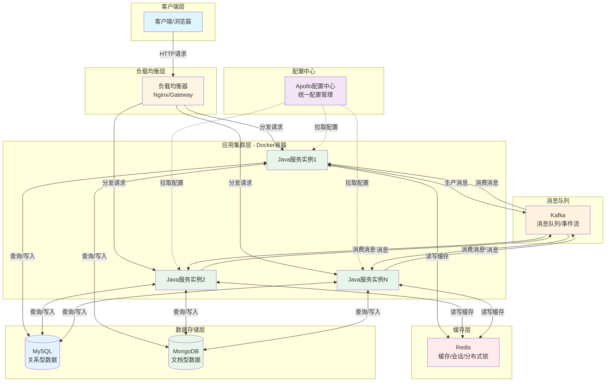
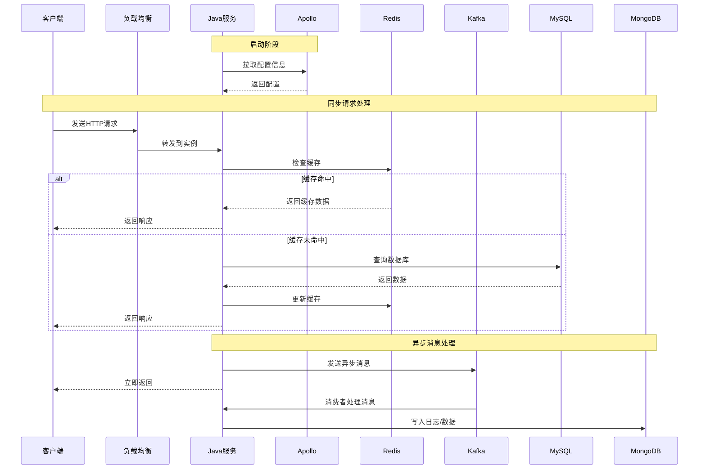

## 组件分工说明

### 1. **Java服务（核心应用层）**
- **职责**：业务逻辑处理、API接口提供、数据处理
- **作用**：整个系统的核心，处理业务请求和响应

### 2. **集群（Cluster）**
- **职责**：高可用、负载均衡、横向扩展
- **作用**：部署多个Java服务实例，保证服务稳定性和性能

### 3. **Kafka（消息队列）**
- **职责**：异步消息处理、事件流、系统解耦
- **作用**：
  - 处理高并发写入
  - 异步任务处理
  - 微服务间通信
  - 日志收集

### 4. **MongoDB（NoSQL数据库）**
- **职责**：非关系型数据存储
- **作用**：
  - 存储文档型数据
  - 处理高并发读写
  - 存储日志、缓存数据

### 5. **MySQL（关系型数据库）**
- **职责**：关系型数据存储
- **作用**：
  - 存储业务核心数据
  - 保证事务一致性
  - 复杂查询支持

### 6. **Apollo（配置中心）**
- **职责**：配置管理、动态配置
- **作用**：
  - 集中管理配置
  - 动态更新配置无需重启
  - 多环境配置管理

### 7. **Redis（缓存）**
- **职责**：缓存、会话存储
- **作用**：
  - 减轻数据库压力
  - 提升读取性能
  - 分布式锁
  - 会话共享

### 8. **Docker（容器化）**
- **职责**：应用容器化、环境标准化
- **作用**：
  - 快速部署
  - 环境一致性
  - 资源隔离

## 协作流程图

## 典型请求处理流程

## 核心协作关系

### 📊 **数据流转**
1. **热数据**：Redis缓存 → 快速响应
2. **冷数据**：MySQL/MongoDB → 持久化存储
3. **异步数据**：Kafka → 削峰填谷

### 🔄 **服务协作**
1. Java服务启动 → Apollo获取配置
2. 请求到达 → 负载均衡分发
3. 优先查询Redis → 未命中查DB → 回写缓存
4. 重要操作 → 写入MySQL（事务）
5. 日志/事件 → 发送Kafka → 异步消费 → MongoDB存储

### 🐳 **部署层面**
- 所有服务通过Docker容器化部署
- 集群模式保证高可用
- 配置统一由Apollo管理
