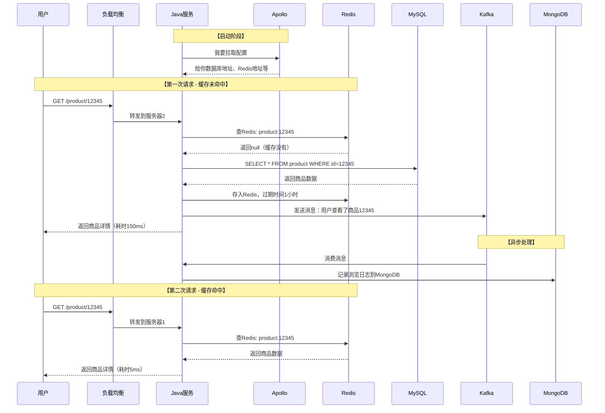
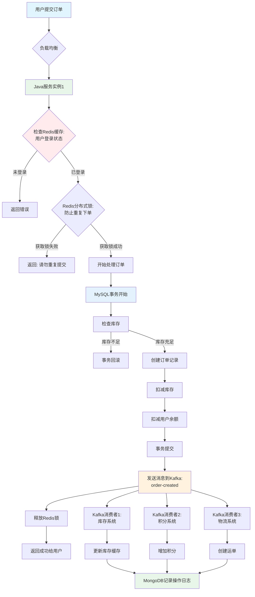

## 一、整体架构理解

这是一个**分布式微服务架构**，可以类比为一个大型购物中心：
- **Java服务集群** = 多个收银台（处理业务）
- **负载均衡** = 门口的引导员（分流顾客）
- **Redis** = 快速取货区（缓存）
- **MySQL/MongoDB** = 大仓库（持久化存储）
- **Kafka** = 传送带（异步处理）
- **Apollo** = 管理规则手册（配置中心）
- **Docker** = 标准化的工作间（容器）

---

## 二、各组件详细解释

### 1️⃣ **Java服务集群**（核心大脑）

**是什么？**
- 你的业务代码运行的地方
- 用Spring Boot等框架开发的应用程序

**做什么？**
```
接收请求 → 处理业务逻辑 → 调用数据库 → 返回结果
```

**为什么要集群？**
- **单点故障问题**：一台服务器挂了，整个系统瘫痪
- **性能瓶颈**：一台服务器处理不了高并发
- **解决方案**：部署3台、5台甚至更多服务器，互为备份

**举例**：
```
用户A请求 → 服务器1处理
用户B请求 → 服务器2处理
用户C请求 → 服务器3处理
如果服务器1挂了，用户A的下一次请求会被分配到服务器2或3
```

---

### 2️⃣ **Apollo配置中心**（规则手册）

**是什么？**
- 携程开源的配置管理平台

**解决什么问题？**

❌ **传统方式的痛点**：
```
配置写在application.properties里
修改配置 → 重新打包 → 重新部署 → 重启服务（停机时间）
有10台服务器 → 要改10次配置文件
```

✅ **使用Apollo后**：
```
配置存在Apollo服务器
修改配置 → 点击发布 → 所有服务自动更新（无需重启）
```

**配置示例**：
```properties
# 数据库连接
db.url=jdbc:mysql://192.168.1.100:3306/mydb
db.username=root
db.password=123456

# Redis配置
redis.host=192.168.1.101
redis.port=6379

# Kafka配置
kafka. servers=192.168.1.102:9092
```

**实际场景**：
```
双11活动：需要临时调整限流阈值
不用Apollo：修改代码 → 重新发布 → 可能错过活动高峰
用Apollo：页面上修改配置 → 立即生效
```

---

### 3️⃣ **Redis缓存**（快速通道）

**是什么？**
- 内存数据库，读写速度极快（微秒级）

**为什么需要？**

**性能对比**：
```
Redis读取：0.1毫秒
MySQL读取：10毫秒（慢100倍）
```

**典型使用场景**：

#### 场景1：热点数据缓存
```java
// 查询商品详情
public Product getProduct(String id) {
    // 1. 先查Redis
    Product product = redis.get("product:" + id);
    
    if (product != null) {
        return product;  // 缓存命中，直接返回
    }
    
    // 2. Redis没有，查MySQL
    product = mysql.query("SELECT * FROM product WHERE id = ?", id);
    
    // 3. 写入Redis，下次直接用
    redis.set("product:" + id, product, 3600);  // 缓存1小时
    
    return product;
}
```

#### 场景2：分布式锁
```java
// 防止超卖（多台服务器同时操作库存）
public boolean buyProduct(String productId) {
    // 尝试获取锁
    boolean locked = redis.setNX("lock:" + productId, "locked", 10);
    
    if (! locked) {
        return false;  // 有其他服务器正在处理
    }
    
    try {
        // 扣减库存
        int stock = getStock(productId);
        if (stock > 0) {
            updateStock(productId, stock - 1);
            return true;
        }
    } finally {
        redis.delete("lock:" + productId);  // 释放锁
    }
}
```

#### 场景3：会话共享
```
用户登录 → 服务器1 → Session存Redis
用户刷新 → 服务器2 → 从Redis读Session → 还是登录状态
```

---

### 4️⃣ **Kafka消息队列**（传送带）

**是什么？**
- 高性能的消息队列系统

**解决什么问题？**

#### 问题1：异步处理
```
❌ 同步方式（慢）：
用户注册 → 写数据库(50ms) → 发邮件(2000ms) → 发短信(1000ms) → 返回
总耗时：3050ms

✅ 异步方式（快）：
用户注册 → 写数据库(50ms) → 发消息到Kafka(5ms) → 返回
总耗时：55ms
后台慢慢处理邮件和短信
```

```java
// 用户注册
public void register(User user) {
    // 1. 保存用户信息
    mysql.save(user);
    
    // 2. 发送消息到Kafka（立即返回）
    kafka.send("user-register", user);
    
    // 3. 立即返回给用户
    return success();
}

// 另一个消费者监听Kafka
@KafkaListener(topic = "user-register")
public void handleRegister(User user) {
    // 异步发送邮件
    emailService.sendWelcomeEmail(user);
    // 异步发送短信
    smsService.sendWelcomeSMS(user);
}
```

#### 问题2：削峰填谷
```
秒杀场景：
瞬间10万请求 → 直接打到数据库 → 数据库崩溃

使用Kafka：
10万请求 → 放入Kafka队列 → 按每秒1000的速度慢慢处理
```

#### 问题3：系统解耦
```
订单系统创建订单后需要：
- 库存系统扣减库存
- 积分系统增加积分
- 物流系统创建运单
- 通知系统发消息

❌ 直接调用：订单系统要知道所有系统的接口
✅ 使用Kafka：订单系统只管发消息，其他系统各自监听
```

---

### 5️⃣ **MySQL关系型数据库**（核心仓库）

**适合存什么？**
- 需要**事务**的数据（订单、支付、账户）
- 需要**复杂查询**的数据（多表关联）
- **核心业务数据**

**示例**：
```sql
-- 订单表
CREATE TABLE orders (
    id BIGINT PRIMARY KEY,
    user_id BIGINT,
    product_id BIGINT,
    amount DECIMAL(10,2),
    status VARCHAR(20),
    create_time DATETIME
);

-- 事务保证：扣款和创建订单要么都成功，要么都失败
BEGIN TRANSACTION;
    UPDATE account SET balance = balance - 100 WHERE user_id = 123;
    INSERT INTO orders VALUES (...);
COMMIT;
```

---

### 6️⃣ **MongoDB文档数据库**（灵活仓库）

**适合存什么？**
- **日志数据**（访问日志、操作日志）
- **非结构化数据**（商品评论、用户动态）
- **频繁变化的数据**（不需要固定表结构）

**对比**：
```
MySQL存储评论：
需要提前设计表结构，字段固定
ALTER TABLE 修改表结构很麻烦

MongoDB存储评论：
{
    "user":  "张三",
    "content": "商品不错",
    "images": ["url1", "url2"],
    "tags": ["好评", "推荐"]  // 随时可以加新字段
}
```

---

### 7️⃣ **Docker容器**（标准化包装）

**解决什么问题？**

```
❌ 传统部署：
开发环境：Windows + JDK8 + MySQL5.7 → 运行正常
测试环境：Linux + JDK11 + MySQL8.0 → 各种报错
生产环境：又是另一套环境 → 又要调试

✅ Docker部署：
开发：打包成Docker镜像
测试：运行同一个镜像
生产：还是同一个镜像
→ 环境完全一致
```

**Dockerfile示例**：
```dockerfile
FROM openjdk:11
COPY myapp.jar /app/
EXPOSE 8080
CMD ["java", "-jar", "/app/myapp.jar"]
```

**一键部署**：
```bash
docker run -d -p 8080:8080 myapp: latest
```

---

## 三、完整请求流程示例

### 场景：用户查看商品详情



---

### 场景：用户下单（完整流程）



---

## 四、关键协作模式

### 1. **缓存模式**（提升性能）
```
请求 → Redis（快） → MySQL（慢但准确）
         ↓ 命中         ↓ 未命中
       直接返回      查DB+回写缓存
```

### 2. **读写分离**（高并发）
```
写操作 → MySQL主库 → 同步到从库
读操作 → MySQL从库（多个）
```

### 3. **最终一致性**（异步处理）
```
核心操作（下单）→ 立即写MySQL（强一致）
次要操作（发邮件）→ Kafka异步（最终一致）
```

### 4. **配置热更新**
```
修改Apollo配置 → 推送到所有Java服务 → 无需重启生效
```

---

## 五、为什么这样设计？

### ✅ **高可用**
- Java服务集群：一台挂了其他顶上
- Redis/MySQL主从：主库挂了从库升级
- Kafka集群：消息不会丢失

### ✅ **高性能**
- Redis缓存：减少数据库压力
- Kafka异步：不阻塞主流程
- 负载均衡：分散请求压力

### ✅ **可扩展**
- 流量大了：加服务器
- 数据多了：数据库分库分表
- 配置改了：Apollo立即生效

### ✅ **易维护**
- Docker：环境一致
- Apollo：配置集中管理
- 日志统一存MongoDB

---

## 六、技术选型对比

| 组件 | 为什么选它 | 替代方案 |
|------|------------|----------|
| **Redis** | 性能最好，功能丰富 | Memcached（功能少） |
| **Kafka** | 高吞吐，持久化 | RabbitMQ（吞吐低）、RocketMQ |
| **MySQL** | 成熟稳定，生态好 | PostgreSQL、Oracle |
| **MongoDB** | 灵活schema，高性能 | Elasticsearch、Cassandra |
| **Apollo** | 国内流行，中文文档 | Nacos、Spring Cloud Config |
| **Docker** | 事实标准 | Podman、containerd |

---
