## 一、服务集群深入解析

### 1. 什么是集群？

**形象比喻**：
```
单机 = 一个厨师做菜
      客人多了 → 厨师累死 → 上菜慢 → 厨师生病餐厅关门

集群 = 三个厨师做菜
      客人多了 → 分配给不同厨师 → 速度快 → 一个厨师生病其他人顶上
```

### 2. 集群如何工作？

#### **负载均衡策略**

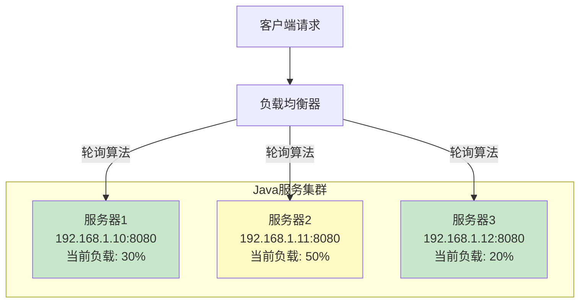
```mermaid
graph TB
    Client[客户端请求]
    LB[负载均衡器]
    
    subgraph "Java服务集群"
        S1[服务器1<br/>192.168.1.10:8080<br/>当前负载:  30%]
        S2[服务器2<br/>192.168.1.11:8080<br/>当前负载:  50%]
        S3[服务器3<br/>192.168.1.12:8080<br/>当前负载:  20%]
    end
    
    Client --> LB
    
    LB -->|轮询算法| S1
    LB -->|轮询算法| S2
    LB -->|轮询算法| S3
    
    style S1 fill:#c8e6c9
    style S2 fill:#fff9c4
    style S3 fill:#c8e6c9
```

**常见负载均衡算法**：

```java
// 1. 轮询（Round Robin）- 最简单
请求1 → 服务器1
请求2 → 服务器2
请求3 → 服务器3
请求4 → 服务器1  // 循环
请求5 → 服务器2

// 2. 加权轮询（Weighted Round Robin）
服务器1：权重3（性能好）
服务器2：权重2（性能中等）
服务器3：权重1（性能差）

10个请求的分配：
服务器1处理5个
服务器2处理3个
服务器3处理2个

// 3. 最少连接（Least Connections）
服务器1：当前10个连接
服务器2：当前5个连接  ← 新请求给它
服务器3：当前8个连接

// 4. IP哈希（IP Hash）
用户IP:  192.168.1.100 → hash → 永远分配到服务器2
好处：同一用户总是访问同一台服务器（会话保持）
```

#### **实际配置示例（Nginx）**

```nginx
# nginx.conf
upstream java_backend {
    # 加权轮询
    server 192.168.1.10:8080 weight=3;
    server 192.168.1.11:8080 weight=2;
    server 192.168.1.12:8080 weight=1;
    
    # 健康检查：3秒内失败2次，踢出30秒
    server 192.168.1.10:8080 max_fails=2 fail_timeout=30s;
}

server {
    listen 80;
    
    location / {
        proxy_pass http://java_backend;
        
        # 传递真实IP
        proxy_set_header X-Real-IP $remote_addr;
        proxy_set_header X-Forwarded-For $proxy_add_x_forwarded_for;
    }
}
```

### 3. 集群的会话问题

**问题场景**：
```
用户登录 → 负载到服务器1 → Session存在服务器1的内存
用户刷新 → 负载到服务器2 → 服务器2没有Session → 要求重新登录 ❌
```

**解决方案：Session共享**

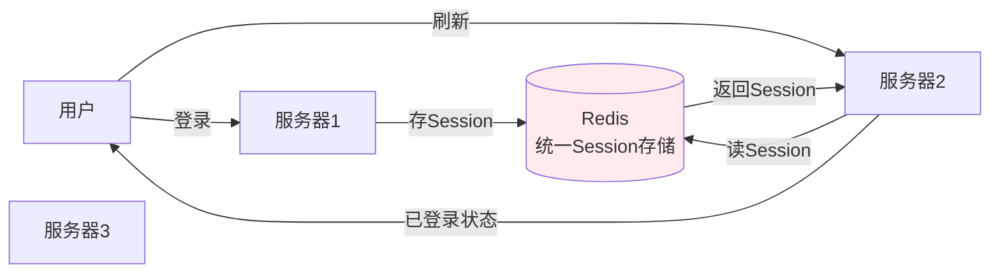
```mermaid
graph LR
    User[用户]
    S1[服务器1]
    S2[服务器2]
    S3[服务器3]
    Redis[(Redis<br/>统一Session存储)]
    
    User -->|登录| S1
    S1 -->|存Session| Redis
    
    User -->|刷新| S2
    S2 -->|读Session| Redis
    Redis -->|返回Session| S2
    S2 -->|已登录状态| User
    
    style Redis fill:#ffebee
```

**代码实现**：

```java
// Spring Boot配置Redis Session
@Configuration
@EnableRedisHttpSession(maxInactiveIntervalInSeconds = 1800) // 30分钟
public class SessionConfig {
    // 自动配置，Session会存到Redis
}

// 使用时完全透明
@RestController
public class UserController {
    
    @PostMapping("/login")
    public Result login(HttpSession session, String username, String password) {
        // 验证用户名密码... 
        User user = userService.login(username, password);
        
        // 存入Session（自动存到Redis）
        session.setAttribute("user", user);
        
        return Result.success();
    }
    
    @GetMapping("/profile")
    public Result getProfile(HttpSession session) {
        // 从Session获取（自动从Redis读）
        User user = (User) session.getAttribute("user");
        
        if (user == null) {
            return Result. error("未登录");
        }
        
        return Result.success(user);
    }
}
```

**Redis中的存储结构**：
```
Key: spring:session:sessions:a1b2c3d4-e5f6-7890
Value: {
    "sessionAttr: user": {
        "id": 123,
        "username": "zhangsan",
        "loginTime": "2025-12-24 10:00:00"
    }
}
TTL: 1800秒
```

---

## 二、Kafka 消息队列深度解析

### 1. **核心概念**

#### 📦 基本组成部分

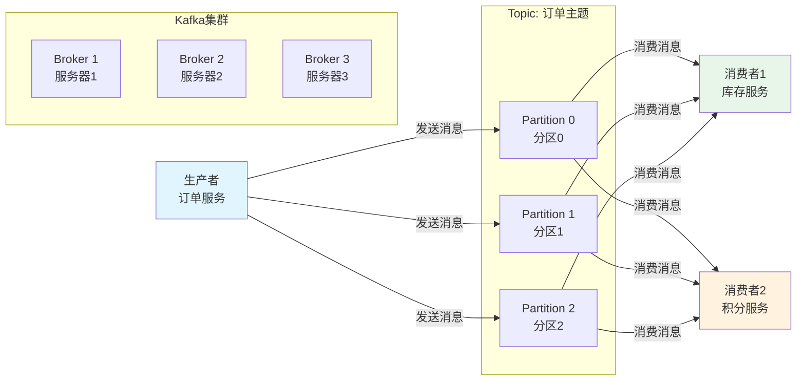
```mermaid
graph LR
    subgraph "Kafka集群"
        B1[Broker 1<br/>服务器1]
        B2[Broker 2<br/>服务器2]
        B3[Broker 3<br/>服务器3]
    end
    
    subgraph "Topic:  订单主题"
        P0[Partition 0<br/>分区0]
        P1[Partition 1<br/>分区1]
        P2[Partition 2<br/>分区2]
    end
    
    Producer[生产者<br/>订单服务] -->|发送消息| P0
    Producer -->|发送消息| P1
    Producer -->|发送消息| P2
    
    P0 -->|消费消息| C1[消费者1<br/>库存服务]
    P1 -->|消费消息| C1
    P2 -->|消费消息| C1
    
    P0 -->|消费消息| C2[消费者2<br/>积分服务]
    P1 -->|消费消息| C2
    P2 -->|消费消息| C2
    
    style Producer fill:#e1f5ff
    style C1 fill:#e8f5e9
    style C2 fill:#fff3e0
```

#### 📋 关键术语解释

| 术语 | 解释 | 类比 |
|------|------|------|
| **Broker** | Kafka服务器节点 | 邮局的一个分局 |
| **Topic** | 消息主题/分类 | 邮件的类型（快递、信件） |
| **Partition** | 主题的分区 | 每个类型有多个邮箱 |
| **Producer** | 消息生产者 | 寄信的人 |
| **Consumer** | 消息消费者 | 收信的人 |
| **Consumer Group** | 消费者组 | 同一家公司的多个收件人 |
| **Offset** | 消息偏移量 | 读到第几封信了 |

---

### 2. **消息生产与消费详解**

#### 生产者发送消息

```java
// 1. 配置Kafka生产者
Properties props = new Properties();
props.put("bootstrap. servers", "192.168.1.100:9092");  // Kafka地址
props.put("key.serializer", "org.apache.kafka.common.serialization. StringSerializer");
props.put("value.serializer", "org. apache.kafka.common.serialization.StringSerializer");

KafkaProducer<String, String> producer = new KafkaProducer<>(props);

// 2. 创建订单后发送消息
public void createOrder(Order order) {
    // 保存订单到MySQL
    orderDao.save(order);
    
    // 发送消息到Kafka
    ProducerRecord<String, String> record = new ProducerRecord<>(
        "order-topic",              // Topic名称
        order.getUserId(),          // Key（用于分区）
        JSON.toJSONString(order)    // Value（消息内容）
    );
    
    // 异步发送
    producer.send(record, new Callback() {
        @Override
        public void onCompletion(RecordMetadata metadata, Exception e) {
            if (e != null) {
                log.error("发送失败", e);
                // 可以重试或记录到数据库
            } else {
                log.info("发送成功，Partition: {}, Offset: {}", 
                    metadata.partition(), metadata.offset());
            }
        }
    });
}
```

#### 消费者消费消息

```java
// 1. 配置Kafka消费者
Properties props = new Properties();
props.put("bootstrap.servers", "192.168.1.100:9092");
props.put("group.id", "inventory-service");  // 消费者组ID
props.put("key.deserializer", "org.apache. kafka.common.serialization.StringDeserializer");
props.put("value.deserializer", "org.apache.kafka.common.serialization.StringDeserializer");

KafkaConsumer<String, String> consumer = new KafkaConsumer<>(props);

// 2. 订阅Topic
consumer.subscribe(Arrays.asList("order-topic"));

// 3. 持续拉取消息
while (true) {
    ConsumerRecords<String, String> records = consumer.poll(Duration.ofMillis(100));
    
    for (ConsumerRecord<String, String> record : records) {
        // 解析消息
        Order order = JSON.parseObject(record.value(), Order.class);
        
        // 处理业务逻辑
        inventoryService.reduceStock(order. getProductId(), order.getQuantity());
        
        System.out.printf("Partition: %d, Offset: %d, Key: %s, Value: %s%n",
            record.partition(), record.offset(), record.key(), record.value());
    }
    
    // 手动提交offset（确保消息处理成功后再提交）
    consumer. commitSync();
}
```

---

### 3. **分区机制详解**

#### 为什么需要分区？

```
场景：订单Topic每秒10万条消息

❌ 单分区：
所有消息在一个队列 → 只能一个消费者读 → 性能瓶颈

✅ 多分区（比如10个）：
消息分散到10个队列 → 10个消费者并行读 → 性能提升10倍
```

#### 分区策略

```java
// 策略1：根据Key的Hash分区（相同Key进同一分区，保证顺序）
record = new ProducerRecord<>("order-topic", userId, orderData);
// userId相同的订单会进入同一个分区，保证该用户的订单顺序

// 策略2：轮询分区（负载均衡）
record = new ProducerRecord<>("order-topic", null, orderData);
// Key为null时，轮流发送到各个分区

// 策略3：自定义分区器
public class CustomPartitioner implements Partitioner {
    @Override
    public int partition(String topic, Object key, byte[] keyBytes,
                        Object value, byte[] valueBytes, Cluster cluster) {
        // VIP用户发到分区0（高优先级处理）
        if (isVipUser(key)) {
            return 0;
        }
        // 普通用户发到其他分区
        return Utils.toPositive(Utils.murmur2(keyBytes)) % (cluster.partitionCountForTopic(topic) - 1) + 1;
    }
}
```

---

### 4. **消费者组机制**

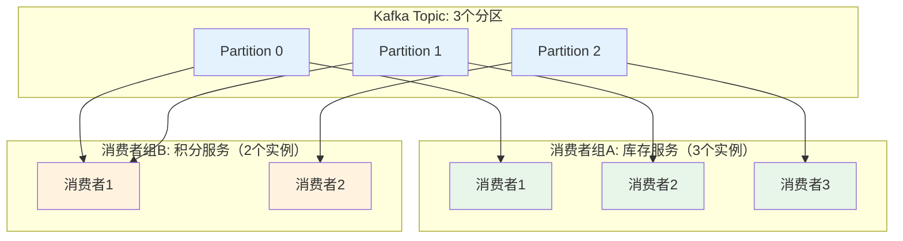
```mermaid
graph TB
    subgraph "Kafka Topic:  3个分区"
        P0[Partition 0]
        P1[Partition 1]
        P2[Partition 2]
    end
    
    subgraph "消费者组A: 库存服务（3个实例）"
        C1A[消费者1]
        C2A[消费者2]
        C3A[消费者3]
    end
    
    subgraph "消费者组B:  积分服务（2个实例）"
        C1B[消费者1]
        C2B[消费者2]
    end
    
    P0 --> C1A
    P1 --> C2A
    P2 --> C3A
    
    P0 --> C1B
    P1 --> C1B
    P2 --> C2B
    
    style P0 fill:#e3f2fd
    style P1 fill:#e3f2fd
    style P2 fill:#e3f2fd
    style C1A fill:#e8f5e9
    style C2A fill:#e8f5e9
    style C3A fill:#e8f5e9
    style C1B fill:#fff3e0
    style C2B fill:#fff3e0
```

**关键规则**：
1. **同一消费者组内**：一个分区只能被一个消费者消费（避免重复）
2. **不同消费者组**：可以重复消费同一条消息（实现广播）
3. **消费者数量 > 分区数**：部分消费者会空闲

---

### 5. **Offset 偏移量管理**

#### Offset 的作用

```
Partition 0的消息队列：
[消息0] [消息1] [消息2] [消息3] [消息4] [消息5] ... 
                  ↑
                Offset=2（消费者已读到这里）
```

#### 三种提交方式

```java
// 1. 自动提交（简单但可能丢消息）
props.put("enable.auto.commit", "true");
props.put("auto.commit.interval.ms", "1000");  // 每秒自动提交

// 风险：消息取出后还没处理完，程序崩溃，offset已提交 → 消息丢失

// 2. 手动同步提交（安全但慢）
while (true) {
    ConsumerRecords<String, String> records = consumer.poll(Duration.ofMillis(100));
    for (ConsumerRecord<String, String> record : records) {
        processRecord(record);  // 处理消息
    }
    consumer.commitSync();  // 处理完才提交，阻塞等待确认
}

// 3. 手动异步提交（性能好）
consumer.commitAsync(new OffsetCommitCallback() {
    @Override
    public void onComplete(Map<TopicPartition, OffsetAndMetadata> offsets, Exception e) {
        if (e != null) {
            log.error("提交失败", e);
        }
    }
});
```

---

### 6. **高可用机制**

#### 副本机制（Replication）

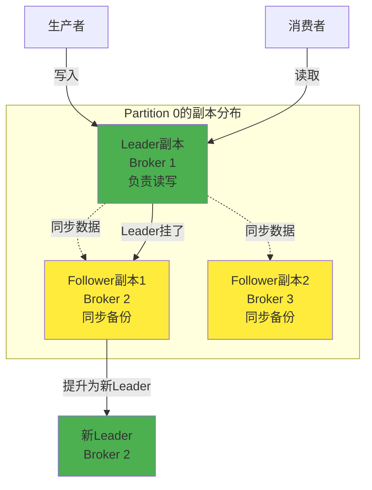
```mermaid
graph TB
    subgraph "Partition 0的副本分布"
        L[Leader副本<br/>Broker 1<br/>负责读写]
        F1[Follower副本1<br/>Broker 2<br/>同步备份]
        F2[Follower副本2<br/>Broker 3<br/>同步备份]
    end
    
    Producer[生产者] -->|写入| L
    Consumer[消费者] -->|读取| L
    
    L -.->|同步数据| F1
    L -.->|同步数据| F2
    
    L -->|Leader挂了| F1
    F1 -->|提升为新Leader| NewL[新Leader<br/>Broker 2]
    
    style L fill:#4caf50
    style F1 fill:#ffeb3b
    style F2 fill:#ffeb3b
    style NewL fill:#4caf50
```

**配置示例**：
```properties
# 每个Partition有3个副本
replication.factor=3

# 至少2个副本同步成功才算写入成功
min.insync. replicas=2
```

---

### 7. **实际应用场景**

#### 场景1：秒杀系统

```java
// 用户点击秒杀按钮
@PostMapping("/seckill")
public Result seckill(Long productId, Long userId) {
    // 1. 立即返回"排队中"
    String requestId = UUID.randomUUID().toString();
    
    // 2. 发送到Kafka（异步处理）
    SeckillRequest request = new SeckillRequest(requestId, productId, userId);
    kafkaTemplate.send("seckill-topic", request);
    
    // 3. 立即返回给用户
    return Result.success("您的请求正在处理，请稍候查询结果", requestId);
}

// 消费者慢慢处理
@KafkaListener(topics = "seckill-topic", concurrency = "10")  // 10个线程并行
public void handleSeckill(SeckillRequest request) {
    // 1. 检查库存（Redis）
    Long stock = redisTemplate.opsForValue().decrement("stock:" + request.getProductId());
    
    if (stock >= 0) {
        // 2. 创建订单（MySQL）
        Order order = createOrder(request);
        
        // 3. 通知用户成功
        notifyUser(request. getUserId(), "秒杀成功！");
    } else {
        // 4. 恢复库存
        redisTemplate.opsForValue().increment("stock:" + request.getProductId());
        
        // 5. 通知用户失败
        notifyUser(request.getUserId(), "商品已售罄");
    }
}
```

#### 场景2：日志收集

```java
// 各个服务打日志
public class KafkaLogAppender extends AppenderBase<ILoggingEvent> {
    @Override
    protected void append(ILoggingEvent event) {
        String log = event.getFormattedMessage();
        kafkaProducer.send(new ProducerRecord<>("app-logs", log));
    }
}

// 日志消费者（ELK架构）
@KafkaListener(topics = "app-logs")
public void consumeLog(String log) {
    // 解析日志
    LogEntry entry = parseLog(log);
    
    // 存入Elasticsearch（方便搜索）
    elasticsearchTemplate.save(entry);
    
    // 如果是ERROR级别，发送告警
    if (entry.getLevel().equals("ERROR")) {
        alertService.sendAlert(entry);
    }
}
```

#### 场景3：数据同步

```java
// MySQL数据变化 → 同步到ES
@KafkaListener(topics = "mysql-binlog")
public void syncToElasticsearch(BinlogEvent event) {
    if (event.getType() == EventType.INSERT) {
        // 新增数据
        elasticsearchRepository.save(event.getData());
    } else if (event.getType() == EventType.UPDATE) {
        // 更新数据
        elasticsearchRepository.update(event.getData());
    } else if (event.getType() == EventType.DELETE) {
        // 删除数据
        elasticsearchRepository.delete(event.getId());
    }
}
```

---

## 三、Redis 深度解析

### 1. **数据结构详解**

#### 五大基础数据结构

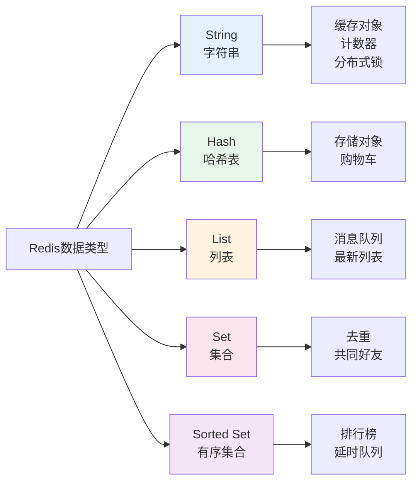
```mermaid
graph LR
    Redis[Redis数据类型] --> String[String<br/>字符串]
    Redis --> Hash[Hash<br/>哈希表]
    Redis --> List[List<br/>列表]
    Redis --> Set[Set<br/>集合]
    Redis --> ZSet[Sorted Set<br/>有序集合]
    
    String --> S1[缓存对象<br/>计数器<br/>分布式锁]
    Hash --> H1[存储对象<br/>购物车]
    List --> L1[消息队列<br/>最新列表]
    Set --> SE1[去重<br/>共同好友]
    ZSet --> Z1[排行榜<br/>延时队列]
    
    style String fill:#e3f2fd
    style Hash fill:#e8f5e9
    style List fill:#fff3e0
    style Set fill:#fce4ec
    style ZSet fill:#f3e5f5
```

---

#### String（字符串）

```bash
# 1. 简单缓存
SET user:1001 '{"name":"张三","age":25}'
GET user:1001

# 2. 计数器（原子操作）
INCR page:view:count       # 页面访问量 +1
INCRBY score:user:1001 10  # 用户积分 +10
DECR stock:product:888     # 库存 -1

# 3. 分布式锁
SET lock: order:12345 "locked" NX EX 10
# NX = Not Exist（键不存在才设置）
# EX 10 = 10秒后过期
```

**Java代码**：
```java
// 页面访问计数
public void recordPageView(String pageId) {
    redisTemplate.opsForValue().increment("page: view:" + pageId);
}

// 获取访问量
public Long getPageView(String pageId) {
    return redisTemplate.opsForValue().get("page:view:" + pageId);
}

// 分布式锁
public boolean tryLock(String key, int expireSeconds) {
    return redisTemplate. opsForValue()
        .setIfAbsent(key, "locked", expireSeconds, TimeUnit.SECONDS);
}
```

---

#### Hash（哈希表）

```bash
# 存储用户信息
HSET user:1001 name "张三"
HSET user:1001 age 25
HSET user:1001 city "北京"

# 批量设置
HMSET user:1002 name "李四" age 30 city "上海"

# 获取单个字段
HGET user:1001 name         # 返回 "张三"

# 获取所有字段
HGETALL user:1001
# 返回：
# 1) "name"
# 2) "张三"
# 3) "age"
# 4) "25"
# 5) "city"
# 6) "北京"

# 购物车场景
HSET cart:user:1001 product: 888 2    # 商品888数量为2
HSET cart:user:1001 product:999 1
HINCRBY cart:user:1001 product:888 1  # 商品888数量 +1
```

**Java代码**：
```java
// 存储用户对象
public void saveUser(User user) {
    Map<String, String> userMap = new HashMap<>();
    userMap.put("name", user. getName());
    userMap.put("age", String.valueOf(user.getAge()));
    userMap.put("city", user.getCity());
    
    redisTemplate.opsForHash().putAll("user:" + user.getId(), userMap);
}

// 获取用户对象
public User getUser(Long userId) {
    Map<Object, Object> entries = redisTemplate.opsForHash()
        .entries("user:" + userId);
    
    User user = new User();
    user.setName((String) entries.get("name"));
    user.setAge(Integer.parseInt((String) entries.get("age")));
    user.setCity((String) entries.get("city"));
    return user;
}

// 购物车加商品
public void addToCart(Long userId, Long productId, int quantity) {
    redisTemplate.opsForHash()
        .increment("cart: user:" + userId, "product:" + productId, quantity);
}
```

---

#### List（列表）

```bash
# 消息队列（左进右出）
LPUSH queue:email "发送邮件给user1"
LPUSH queue:email "发送邮件给user2"
RPOP queue:email                      # 取出 "发送邮件给user1"

# 最新文章列表
LPUSH articles:latest "文章ID: 999"
LPUSH articles:latest "文章ID:998"
LRANGE articles:latest 0 9            # 获取最新10篇文章

# 阻塞队列
BRPOP queue:email 10                  # 阻塞10秒等待消息
```

**Java代码**：
```java
// 发布文章（加入最新列表）
public void publishArticle(Long articleId) {
    redisTemplate.opsForList().leftPush("articles: latest", articleId. toString());
    
    // 保持列表只有100条
    redisTemplate. opsForList().trim("articles:latest", 0, 99);
}

// 获取最新文章
public List<String> getLatestArticles(int count) {
    return redisTemplate.opsForList().range("articles:latest", 0, count - 1);
}

// 简单消息队列
public void sendTask(String task) {
    redisTemplate. opsForList().leftPush("task:queue", task);
}

public String getTask() {
    return redisTemplate. opsForList().rightPop("task:queue");
}
```

---

#### Set（集合）

```bash
# 用户标签
SADD user:1001:tags "Java" "Redis" "MySQL"
SADD user:1002:tags "Python" "Redis" "MongoDB"

# 共同标签（交集）
SINTER user: 1001:tags user:1002:tags   # 返回 "Redis"

# 抽奖（随机取）
SADD lottery:users "user1" "user2" "user3" "user4"
SRANDMEMBER lottery:users 1            # 随机抽1个
SPOP lottery:users 1                   # 随机抽1个并移除

# 去重（点赞）
SADD article:999:likes "user1"
SADD article:999:likes "user1"         # 重复添加无效
SCARD article:999:likes                # 统计点赞数
```

**Java代码**：
```java
// 用户点赞
public void likeArticle(Long articleId, Long userId) {
    redisTemplate.opsForSet().add("article:" + articleId + ":likes", userId. toString());
}

// 取消点赞
public void unlikeArticle(Long articleId, Long userId) {
    redisTemplate.opsForSet().remove("article:" + articleId + ":likes", userId.toString());
}

// 是否已点赞
public boolean hasLiked(Long articleId, Long userId) {
    return redisTemplate.opsForSet()
        .isMember("article:" + articleId + ":likes", userId.toString());
}

// 点赞总数
public Long getLikeCount(Long articleId) {
    return redisTemplate.opsForSet().size("article:" + articleId + ": likes");
}

// 共同好友
public Set<String> getCommonFriends(Long userId1, Long userId2) {
    return redisTemplate.opsForSet()
        .intersect("user:" + userId1 + ":friends", "user:" + userId2 + ":friends");
}
```

---

#### Sorted Set（有序集合）

```bash
# 排行榜
ZADD rank:score user1 100
ZADD rank:score user2 200
ZADD rank:score user3 150

# 获取前3名
ZREVRANGE rank:score 0 2 WITHSCORES
# 返回：
# 1) "user2"
# 2) "200"
# 3) "user3"
# 4) "150"
# 5) "user1"
# 6) "100"

# 获取某个用户的排名
ZREVRANK rank:score user3              # 返回 1（第2名，从0开始）

# 增加分数
ZINCRBY rank: score 50 user1            # user1分数 +50

# 延时队列（按时间排序）
ZADD delay:queue task1 1640000000      # Unix时间戳
ZADD delay:queue task2 1640000100
ZRANGEBYSCORE delay:queue 0 当前时间戳  # 取出到期的任务
```

**Java代码**：
```java
// 添加用户分数
public void addScore(Long userId, double score) {
    redisTemplate.opsForZSet().add("rank:score", userId.toString(), score);
}

// 增加分数
public void incrementScore(Long userId, double delta) {
    redisTemplate. opsForZSet().incrementScore("rank:score", userId. toString(), delta);
}

// 获取排行榜（前N名）
public Set<ZSetOperations.TypedTuple<String>> getTopN(int n) {
    return redisTemplate.opsForZSet()
        .reverseRangeWithScores("rank:score", 0, n - 1);
}

// 获取用户排名
public Long getUserRank(Long userId) {
    return redisTemplate.opsForZSet()
        .reverseRank("rank:score", userId.toString());
}

// 延时任务队列
public void addDelayTask(String taskId, long executeTime) {
    redisTemplate.opsForZSet().add("delay:queue", taskId, executeTime);
}

// 获取到期任务
public Set<String> getExpiredTasks() {
    long now = System.currentTimeMillis();
    return redisTemplate. opsForZSet()
        .rangeByScore("delay:queue", 0, now);
}
```

---

### 2. **缓存策略详解**

#### 缓存更新策略

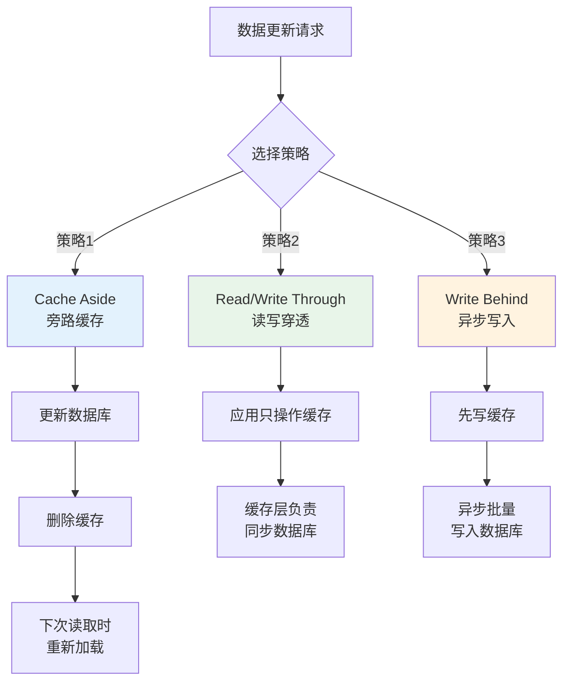
```mermaid
graph TD
    A[数据更新请求] --> B{选择策略}
    
    B -->|策略1| C[Cache Aside<br/>旁路缓存]
    B -->|策略2| D[Read/Write Through<br/>读写穿透]
    B -->|策略3| E[Write Behind<br/>异步写入]
    
    C --> C1[更新数据库]
    C1 --> C2[删除缓存]
    C2 --> C3[下次读取时<br/>重新加载]
    
    D --> D1[应用只操作缓存]
    D1 --> D2[缓存层负责<br/>同步数据库]
    
    E --> E1[先写缓存]
    E1 --> E2[异步批量<br/>写入数据库]
    
    style C fill:#e3f2fd
    style D fill:#e8f5e9
    style E fill:#fff3e0
```

#### 策略1：Cache Aside（最常用）

```java
// 读数据
public Product getProduct(Long id) {
    // 1. 先查缓存
    String cacheKey = "product:" + id;
    Product product = redisTemplate.opsForValue().get(cacheKey);
    
    if (product != null) {
        return product;  // 缓存命中
    }
    
    // 2. 缓存未命中，查数据库
    product = productDao.selectById(id);
    
    if (product != null) {
        // 3. 写入缓存
        redisTemplate.opsForValue().set(cacheKey, product, 1, TimeUnit.HOURS);
    }
    
    return product;
}

// 写数据
public void updateProduct(Product product) {
    // 1. 先更新数据库
    productDao.updateById(product);
    
    // 2. 删除缓存（而不是更新缓存）
    redisTemplate.delete("product:" + product. getId());
    
    // 为什么删除而不是更新？
    // 因为可能有多个请求同时更新，删除缓存更安全
}
```

#### 策略2：Read/Write Through

```java
// 使用Spring Cache自动管理
@Cacheable(value = "products", key = "#id")
public Product getProduct(Long id) {
    // Spring自动处理：先查缓存，未命中则执行方法并缓存结果
    return productDao.selectById(id);
}

@CachePut(value = "products", key = "#product.id")
public Product updateProduct(Product product) {
    // Spring自动处理：更新数据库后更新缓存
    productDao.updateById(product);
    return product;
}

@CacheEvict(value = "products", key = "#id")
public void deleteProduct(Long id) {
    // Spring自动处理：删除数据库后删除缓存
    productDao.deleteById(id);
}
```

---

### 3. **缓存问题与解决方案**

#### 问题1：缓存穿透（查询不存在的数据）

```
场景：恶意攻击查询ID=-1的商品
请求 → 缓存没有 → 数据库也没有 → 每次都打到数据库
```

**解决方案**：

```java
// 方案1：缓存空值
public Product getProduct(Long id) {
    String cacheKey = "product:" + id;
    Product product = redisTemplate.opsForValue().get(cacheKey);
    
    if (product != null) {
        if (product.getId() == null) {
            return null;  // 之前查过，数据库没有
        }
        return product;
    }
    
    product = productDao.selectById(id);
    
    if (product == null) {
        // 缓存一个空对象，过期时间短一点
        redisTemplate. opsForValue().set(cacheKey, new Product(), 5, TimeUnit.MINUTES);
    } else {
        redisTemplate. opsForValue().set(cacheKey, product, 1, TimeUnit.HOURS);
    }
    
    return product;
}

// 方案2：布隆过滤器（Bloom Filter）
@Autowired
private RedissonClient redissonClient;

public Product getProduct(Long id) {
    // 1. 布隆过滤器判断是否存在
    RBloomFilter<Long> bloomFilter = redissonClient.getBloomFilter("product:bloom");
    if (! bloomFilter.contains(id)) {
        return null;  // 一定不存在，直接返回
    }
    
    // 2. 可能存在，查缓存和数据库
    // ... 正常逻辑
}

// 初始化布隆过滤器
public void initBloomFilter() {
    RBloomFilter<Long> bloomFilter = redissonClient.getBloomFilter("product:bloom");
    bloomFilter.tryInit(100000, 0.01);  // 预计10万条数据，1%误判率
    
    // 加载所有商品ID
    List<Long> productIds = productDao.selectAllIds();
    productIds.forEach(bloomFilter::add);
}
```

---

#### 问题2：缓存击穿（热点数据过期）

```
场景：爆款商品缓存过期瞬间
1000个请求同时到达 → 缓存都没有 → 1000个请求都打到数据库
```

**解决方案**：

```java
// 方案1：互斥锁（只让一个请求查数据库）
public Product getProduct(Long id) {
    String cacheKey = "product:" + id;
    Product product = redisTemplate.opsForValue().get(cacheKey);
    
    if (product != null) {
        return product;
    }
    
    // 尝试获取锁
    String lockKey = "lock:product:" + id;
    boolean locked = redisTemplate.opsForValue()
        .setIfAbsent(lockKey, "1", 10, TimeUnit. SECONDS);
    
    if (locked) {
        try {
            // 拿到锁，查数据库
            product = productDao.selectById(id);
            redisTemplate. opsForValue().set(cacheKey, product, 1, TimeUnit.HOURS);
            return product;
        } finally {
            redisTemplate. delete(lockKey);  // 释放锁
        }
    } else {
        // 没拿到锁，等待一下再查缓存
        Thread.sleep(50);
        return getProduct(id);  // 递归调用
    }
}

// 方案2：永不过期（逻辑过期）
public Product getProduct(Long id) {
    String cacheKey = "product:" + id;
    CacheData cacheData = redisTemplate. opsForValue().get(cacheKey);
    
    if (cacheData == null) {
        // 缓存重建
        return rebuildCache(id);
    }
    
    // 检查逻辑过期时间
    if (cacheData.getExpireTime().isBefore(LocalDateTime.now())) {
        // 已过期，异步重建缓存
        executorService.submit(() -> rebuildCache(id));
        
        // 返回旧数据（虽然过期但可用）
        return cacheData. getProduct();
    }
    
    return cacheData.getProduct();
}

private Product rebuildCache(Long id) {
    // 获取互斥锁
    String lockKey = "lock:product:" + id;
    if (! tryLock(lockKey)) {
        return null;  // 有其他线程在重建
    }
    
    try {
        Product product = productDao.selectById(id);
        CacheData cacheData = new CacheData();
        cacheData.setProduct(product);
        cacheData.setExpireTime(LocalDateTime.now().plusHours(1));  // 逻辑过期时间
        
        redisTemplate.opsForValue().set("product:" + id, cacheData);  // 不设置Redis过期时间
        return product;
    } finally {
        unlock(lockKey);
    }
}
```

---

#### 问题3：缓存雪崩（大量缓存同时过期）

```
场景：凌晨2点批量导入商品，设置1小时过期
凌晨3点，所有缓存同时失效 → 数据库压力暴增
```

**解决方案**：

```java
// 方案1：过期时间加随机值
public void cacheProduct(Product product) {
    int baseExpire = 3600;  // 1小时
    int randomExpire = new Random().nextInt(300);  // 0-5分钟随机
    int expire = baseExpire + randomExpire;
    
    redisTemplate.opsForValue().set(
        "product:" + product. getId(), 
        product, 
        expire, 
        TimeUnit.SECONDS
    );
}

// 方案2：热点数据永不过期
public void cacheHotProduct(Product product) {
    // 热门商品不设置过期时间
    redisTemplate.opsForValue().set("hot: product:" + product.getId(), product);
    
    // 定时任务定期更新
}

// 方案3：使用Redis集群 + 多级缓存
public Product getProduct(Long id) {
    // L1: 本地缓存（Caffeine）
    Product product = localCache.get(id);
    if (product != null) return product;
    
    // L2: Redis缓存
    product = redisTemplate. opsForValue().get("product:" + id);
    if (product != null) {
        localCache.put(id, product);
        return product;
    }
    
    // L3: 数据库
    product = productDao.selectById(id);
    if (product != null) {
        redisTemplate.opsForValue().set("product:" + id, product, 1, TimeUnit. HOURS);
        localCache.put(id, product);
    }
    
    return product;
}
```

---

### 4. **分布式锁深入**

#### Redisson 实现分布式锁

```java
@Autowired
private RedissonClient redissonClient;

// 简单使用
public void secKill(Long productId) {
    RLock lock = redissonClient.getLock("seckill:" + productId);
    
    try {
        // 尝试加锁，最多等待10秒，锁30秒后自动释放
        boolean locked = lock. tryLock(10, 30, TimeUnit.SECONDS);
        
        if (! locked) {
            throw new BusinessException("系统繁忙，请稍后重试");
        }
        
        // 执行业务逻辑
        int stock = getStock(productId);
        if (stock > 0) {
            reduceStock(productId);
            createOrder();
        }
    } catch (InterruptedException e) {
        Thread.currentThread().interrupt();
    } finally {
        lock.unlock();  // 释放锁
    }
}

// 可重入锁演示
public void demo() {
    RLock lock = redissonClient.getLock("mylock");
    lock.lock();
    
    try {
        method1();  // method1内部也尝试获取同一把锁
    } finally {
        lock.unlock();
    }
}

public void method1() {
    RLock lock = redissonClient.getLock("mylock");
    lock.lock();  // 可重入，不会死锁
    try {
        // 业务逻辑
    } finally {
        lock.unlock();
    }
}

// 联锁（MultiLock）
public void multiLock() {
    RLock lock1 = redissonClient.getLock("lock1");
    RLock lock2 = redissonClient.getLock("lock2");
    RLock lock3 = redissonClient.getLock("lock3");
    
    RedissonMultiLock multiLock = new RedissonMultiLock(lock1, lock2, lock3);
    
    try {
        multiLock. lock();
        // 同时持有3把锁
    } finally {
        multiLock.unlock();
    }
}

// 红锁（RedLock）- 多个独立Redis实例
public void redLock() {
    RLock lock1 = redissonClient1.getLock("lock");
    RLock lock2 = redissonClient2.getLock("lock");
    RLock lock3 = redissonClient3.getLock("lock");
    
    RedissonRedLock redLock = new RedissonRedLock(lock1, lock2, lock3);
    
    try {
        // 至少在N/2+1个实例上加锁成功才算成功
        redLock.lock();
    } finally {
        redLock.unlock();
    }
}
```

---

### 5. **持久化机制**

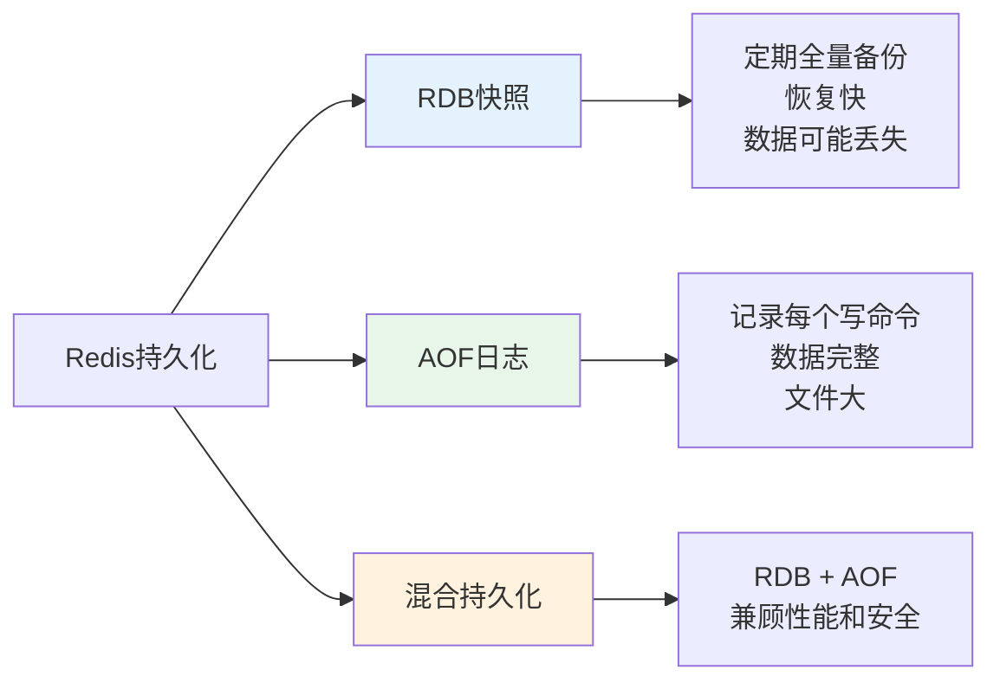
```mermaid
graph LR
    Redis[Redis持久化] --> RDB[RDB快照]
    Redis --> AOF[AOF日志]
    Redis --> Mix[混合持久化]
    
    RDB --> R1[定期全量备份<br/>恢复快<br/>数据可能丢失]
    AOF --> A1[记录每个写命令<br/>数据完整<br/>文件大]
    Mix --> M1[RDB + AOF<br/>兼顾性能和安全]
    
    style RDB fill:#e3f2fd
    style AOF fill:#e8f5e9
    style Mix fill:#fff3e0
```

**配置示例**：

```conf
# RDB配置
save 900 1      # 900秒内至少1个key变化，触发快照
save 300 10     # 300秒内至少10个key变化
save 60 10000   # 60秒内至少10000个key变化

# AOF配置
appendonly yes
appendfsync everysec  # 每秒同步一次（推荐）
# appendfsync always  # 每个命令都同步（最安全但慢）
# appendfsync no      # 由操作系统决定（最快但不安全）

# 混合持久化（Redis 4.0+）
aof-use-rdb-preamble yes
```

---

## 四、MySQL 深度解析

### 1. **事务ACID详解**

```java
// 转账示例
@Transactional(rollbackFor = Exception.class)
public void transfer(Long fromUserId, Long toUserId, BigDecimal amount) {
    // 1. 扣减转出账户
    accountDao.deductBalance(fromUserId, amount);
    
    // 2. 模拟异常
    if (amount.compareTo(new BigDecimal("1000")) > 0) {
        throw new RuntimeException("单笔转账不能超过1000元");
    }
    
    // 3. 增加转入账户
    accountDao.addBalance(toUserId, amount);
    
    // 4. 记录流水
    transactionLogDao.insert(new TransactionLog(fromUserId, toUserId, amount));
}
// 如果抛出异常，1、3、4步骤都会回滚
```

#### ACID特性

| 特性 | 说明 | 实现机制 |
|------|------|----------|
| **原子性 (Atomicity)** | 全部成功或全部失败 | Undo Log（回滚日志） |
| **一致性 (Consistency)** | 数据完整性约束 | 事务 + 约束 |
| **隔离性 (Isolation)** | 并发事务互不干扰 | 锁 + MVCC |
| **持久性 (Durability)** | 提交后永久保存 | Redo Log（重做日志） |

---

### 2. **事务隔离级别**

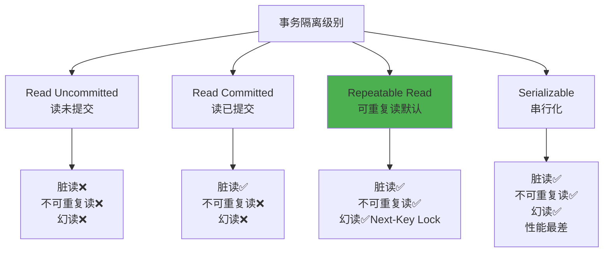
```mermaid
graph TB
    A[事务隔离级别] --> B[Read Uncommitted<br/>读未提交]
    A --> C[Read Committed<br/>读已提交]
    A --> D[Repeatable Read<br/>可重复读默认]
    A --> E[Serializable<br/>串行化]
    
    B --> B1[脏读❌<br/>不可重复读❌<br/>幻读❌]
    C --> C1[脏读✅<br/>不可重复读❌<br/>幻读❌]
    D --> D1[脏读✅<br/>不可重复读✅<br/>幻读✅Next-Key Lock]
    E --> E1[脏读✅<br/>不可重复读✅<br/>幻读✅<br/>性能最差]
    
    style D fill:#4caf50
```

#### 并发问题演示

```sql
-- 脏读（Read Uncommitted会出现）
-- 事务A
BEGIN;
UPDATE account SET balance = 1000 WHERE id = 1;
-- 未提交

-- 事务B
BEGIN;
SELECT balance FROM account WHERE id = 1;  -- 读到1000（事务A未提交的数据）
-- 如果事务A回滚，事务B读到的是脏数据


-- 不可重复读（Read Committed会出现）
-- 事务A
BEGIN;
SELECT balance FROM account WHERE id = 1;  -- 读到500

-- 事务B
BEGIN;
UPDATE account SET balance = 1000 WHERE id = 1;
COMMIT;

-- 事务A
SELECT balance FROM account WHERE id = 1;  -- 读到1000（同一事务内两次读结果不同）


-- 幻读（Repeatable Read在某些情况会出现）
-- 事务A
BEGIN;
SELECT * FROM account WHERE balance > 500;  -- 返回3条

-- 事务B
BEGIN;
INSERT INTO account (id, balance) VALUES (4, 600);
COMMIT;

-- 事务A
SELECT * FROM account WHERE balance > 500;  -- 返回4条（多了一条幻影记录）
```

**设置隔离级别**：
```sql
-- 全局设置
SET GLOBAL TRANSACTION ISOLATION LEVEL REPEATABLE READ;

-- 会话级别
SET SESSION TRANSACTION ISOLATION LEVEL READ COMMITTED;

-- 单个事务
SET TRANSACTION ISOLATION LEVEL SERIALIZABLE;
START TRANSACTION;
-- ... 
COMMIT;
```

---

### 3. **锁机制详解**

#### 锁的分类

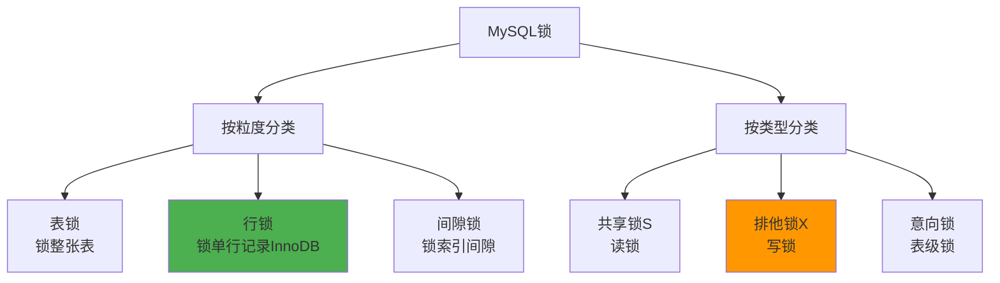
```mermaid
graph TB
    Lock[MySQL锁] --> L1[按粒度分类]
    Lock --> L2[按类型分类]
    
    L1 --> T1[表锁<br/>锁整张表]
    L1 --> R1[行锁<br/>锁单行记录InnoDB]
    L1 --> G1[间隙锁<br/>锁索引间隙]
    
    L2 --> S1[共享锁S<br/>读锁]
    L2 --> X1[排他锁X<br/>写锁]
    L2 --> I1[意向锁<br/>表级锁]
    
    style R1 fill:#4caf50
    style X1 fill:#ff9800
```

#### 行锁示例

```sql
-- 共享锁（S锁）：其他事务可以读，不能写
SELECT * FROM account WHERE id = 1 LOCK IN SHARE MODE;

-- 排他锁（X锁）：其他事务不能读也不能写
SELECT * FROM account WHERE id = 1 FOR UPDATE;

-- 实际场景：秒杀扣库存
BEGIN;

-- 锁定商品库存行
SELECT stock FROM product WHERE id = 888 FOR UPDATE;

-- 检查库存
IF stock > 0 THEN
    UPDATE product SET stock = stock - 1 WHERE id = 888;
    INSERT INTO orders (...) VALUES (...);
END IF;

COMMIT;
```

#### Next-Key Lock（解决幻读）

```sql
-- 假设有索引值：10, 20, 30
-- 间隙：(-∞, 10), (10, 20), (20, 30), (30, +∞)

-- 事务A：范围查询
BEGIN;
SELECT * FROM account WHERE id BETWEEN 10 AND 30 FOR UPDATE;
-- 锁住：(10, 20, 30]这些行 + (10, 30)这个间隙

-- 事务B：尝试插入
BEGIN;
INSERT INTO account (id, balance) VALUES (15, 100);  -- 被阻塞（15在间隙内）
INSERT INTO account (id, balance) VALUES (5, 100);   -- 可以执行（5不在间隙内）
```

---

### 4. **索引优化**

#### 索引类型

```sql
-- 1. 主键索引
CREATE TABLE users (
    id BIGINT PRIMARY KEY,
    name VARCHAR(50)
);

-- 2. 唯一索引
CREATE UNIQUE INDEX idx_email ON users(email);

-- 3. 普通索引
CREATE INDEX idx_name ON users(name);

-- 4. 组合索引（最左前缀原则）
CREATE INDEX idx_name_age_city ON users(name, age, city);

-- 可以使用索引的查询：
SELECT * FROM users WHERE name = '张三';  -- ✅
SELECT * FROM users WHERE name = '张三' AND age = 25;  -- ✅
SELECT * FROM users WHERE name = '张三' AND age = 25 AND city = '北京';  -- ✅
SELECT * FROM users WHERE name = '张三' AND city = '北京';  -- ✅（age可以跳过）

-- 不能使用索引的查询：
SELECT * FROM users WHERE age = 25;  -- ❌（跳过了name）
SELECT * FROM users WHERE city = '北京';  -- ❌（跳过了name和age）

-- 5. 全文索引
CREATE FULLTEXT INDEX idx_content ON articles(content);
SELECT * FROM articles WHERE MATCH(content) AGAINST('Java Redis');

-- 6. 覆盖索引（索引包含所有查询字段）
CREATE INDEX idx_name_age ON users(name, age);
SELECT name, age FROM users WHERE name = '张三';  -- 不需要回表查询
```

#### 索引失效场景

```sql
-- 1. 使用函数
SELECT * FROM users WHERE YEAR(create_time) = 2023;  -- ❌索引失效
SELECT * FROM users WHERE create_time BETWEEN '2023-01-01' AND '2023-12-31';  -- ✅使用索引

-- 2. 类型转换
SELECT * FROM users WHERE phone = 13800138000;  -- ❌（phone是VARCHAR，发生隐式转换）
SELECT * FROM users WHERE phone = '13800138000';  -- ✅

-- 3. 模糊查询（前缀匹配）
SELECT * FROM users WHERE name LIKE '%张%';  -- ❌
SELECT * FROM users WHERE name LIKE '张%';   -- ✅

-- 4. OR条件（部分字段无索引）
SELECT * FROM users WHERE name = '张三' OR address = '北京';  -- ❌（address无索引）
SELECT * FROM users WHERE name = '张三' OR email = 'test@qq.com';  -- ✅（都有索引）

-- 5. 不等于
SELECT * FROM users WHERE age != 25;  -- ❌
SELECT * FROM users WHERE age > 25 OR age < 25;  -- 可能使用索引

-- 6. IS NULL / IS NOT NULL
SELECT * FROM users WHERE email IS NULL;  -- 可能失效（取决于NULL值比例）
```

---

### 5. **EXPLAIN执行计划**

```sql
EXPLAIN SELECT * FROM orders WHERE user_id = 1001;
```

**关键字段**：

| 字段 | 说明 | 重点关注 |
|------|------|----------|
| **type** | 访问类型 | system > const > eq_ref > ref > range > index > ALL |
| **possible_keys** | 可能使用的索引 | - |
| **key** | 实际使用的索引 | NULL表示未使用索引 |
| **rows** | 扫描行数 | 越小越好 |
| **Extra** | 额外信息 | Using filesort（需要排序）<br/>Using temporary（需要临时表）<br/>Using index（覆盖索引） |

**示例分析**：
```sql
-- 全表扫描（最差）
EXPLAIN SELECT * FROM orders WHERE amount > 100;
-- type: ALL, rows: 100000 ❌

-- 使用索引（优化后）
CREATE INDEX idx_amount ON orders(amount);
EXPLAIN SELECT * FROM orders WHERE amount > 100;
-- type: range, rows: 5000 ✅
```

你说得对！我刚才讲解时确实遗漏了很多重要内容。让我继续完成剩余的深度解析。

---

## 五、MongoDB 深度解析

### 1. **文档模型 vs 关系模型**

#### 数据建模对比

```javascript
// MySQL关系模型（需要3张表）
-- users表
CREATE TABLE users (
    id BIGINT PRIMARY KEY,
    name VARCHAR(50),
    email VARCHAR(100)
);

-- orders表
CREATE TABLE orders (
    id BIGINT PRIMARY KEY,
    user_id BIGINT,
    total DECIMAL(10,2),
    FOREIGN KEY (user_id) REFERENCES users(id)
);

-- order_items表
CREATE TABLE order_items (
    id BIGINT PRIMARY KEY,
    order_id BIGINT,
    product_name VARCHAR(100),
    quantity INT,
    price DECIMAL(10,2),
    FOREIGN KEY (order_id) REFERENCES orders(id)
);

-- 查询需要JOIN
SELECT u.name, o.total, oi.product_name
FROM users u
JOIN orders o ON u.id = o.user_id
JOIN order_items oi ON o.id = oi.order_id;
```

```javascript
// MongoDB文档模型（一个集合搞定）
db.orders.insertOne({
    _id: ObjectId("507f1f77bcf86cd799439011"),
    user: {
        id: 1001,
        name: "张三",
        email: "zhang@example.com"
    },
    total: 299.99,
    items: [
        {
            product_name: "机械键盘",
            quantity:  1,
            price: 199.99
        },
        {
            product_name: "鼠标垫",
            quantity: 2,
            price: 50.00
        }
    ],
    status: "completed",
    created_at: ISODate("2023-12-01T10:30:00Z")
});

// 查询无需JOIN
db.orders.find({ "user.id": 1001 });
```

---

### 2. **CRUD操作详解**

#### 插入数据

```javascript
// 插入单条
db.products.insertOne({
    name: "iPhone 15",
    price: 5999,
    stock: 100,
    category: "手机",
    specs: {
        screen: "6.1英寸",
        chip: "A17",
        storage: "128GB"
    },
    tags: ["5G", "双卡", "Face ID"]
});

// 插入多条
db.products. insertMany([
    { name: "iPad", price: 3999, stock: 50 },
    { name: "MacBook", price: 9999, stock: 30 },
    { name: "AirPods", price: 1299, stock: 200 }
]);
```

#### 查询数据

```javascript
// 基础查询
db.products. find({ category: "手机" });

// 比较运算符
db.products.find({ price: { $gt: 5000 } });  // 大于5000
db.products.find({ stock: { $gte: 50, $lte: 100 } });  // 50-100之间
db.products.find({ category: { $in: ["手机", "平板"] } });  // 手机或平板
db.products.find({ category: { $ne: "配件" } });  // 不是配件

// 逻辑运算符
db.products.find({
    $and: [
        { price: { $lt: 10000 } },
        { stock: { $gt: 0 } }
    ]
});

db.products.find({
    $or: [
        { category: "手机" },
        { price: { $lt: 2000 } }
    ]
});

// 嵌套文档查询
db.products.find({ "specs.storage": "256GB" });

// 数组查询
db.products.find({ tags: "5G" });  // tags数组包含"5G"
db.products.find({ tags: { $all: ["5G", "双卡"] } });  // 同时包含两个标签
db.products.find({ tags: { $size: 3 } });  // tags数组长度为3

// 正则表达式
db.products. find({ name: /iPhone/i });  // 不区分大小写

// 投影（只返回指定字段）
db.products.find(
    { category: "手机" },
    { name: 1, price: 1, _id: 0 }  // 1=返回, 0=不返回
);

// 排序、分页
db.products.find({ category: "手机" })
    .sort({ price: -1 })  // 按价格降序
    .skip(10)             // 跳过10条
    .limit(10);           // 返回10条
```

#### 更新数据

```javascript
// 更新单条
db.products. updateOne(
    { name: "iPhone 15" },
    { $set: { price: 5799, stock: 95 } }
);

// 更新多条
db.products.updateMany(
    { category: "手机" },
    { $set: { on_sale: true } }
);

// 更新运算符
db.products.updateOne(
    { name: "iPhone 15" },
    {
        $inc: { stock: -1 },              // 库存-1
        $set: { last_update: new Date() }, // 设置字段
        $push: { tags: "热销" },          // 数组添加元素
        $addToSet: { tags: "新品" }       // 数组添加（不重复）
    }
);

// 数组操作
db.products.updateOne(
    { name: "iPhone 15" },
    { $pull: { tags: "新品" } }  // 从数组删除
);

db.products.updateOne(
    { name: "iPhone 15" },
    { $pop: { tags: 1 } }  // 删除数组最后一个元素（-1删除第一个）
);

// upsert（不存在则插入）
db.products.updateOne(
    { name: "新产品" },
    { $set: { price: 999, stock: 100 } },
    { upsert: true }
);

// 替换整个文档
db.products. replaceOne(
    { name: "iPhone 15" },
    {
        name: "iPhone 15 Pro",
        price: 7999,
        stock: 50
    }
);
```

#### 删除数据

```javascript
// 删除单条
db.products.deleteOne({ name: "iPhone 15" });

// 删除多条
db.products.deleteMany({ stock: 0 });

// 删除所有
db.products.deleteMany({});
```

---

### 3. **聚合管道（Aggregation）**

```javascript
// 场景：统计每个分类的商品数量和平均价格
db.products. aggregate([
    // 阶段1：筛选
    { $match:  { stock: { $gt: 0 } } },
    
    // 阶段2：分组
    {
        $group: {
            _id: "$category",
            count: { $sum: 1 },
            avgPrice: { $avg: "$price" },
            maxPrice: { $max: "$price" },
            minPrice: { $min: "$price" }
        }
    },
    
    // 阶段3：排序
    { $sort: { count: -1 } },
    
    // 阶段4：限制结果
    { $limit: 5 }
]);

// 输出：
[
    { _id: "手机", count: 15, avgPrice: 4500, maxPrice: 9999, minPrice: 1999 },
    { _id:  "平板", count: 10, avgPrice: 3500, maxPrice: 7999, minPrice: 2199 },
    ... 
]
```

#### 复杂聚合示例

```javascript
// 场景：订单统计分析
db.orders.aggregate([
    // 1. 解构数组（每个item变成一条记录）
    { $unwind: "$items" },
    
    // 2. 筛选2023年的订单
    {
        $match: {
            created_at: {
                $gte: ISODate("2023-01-01"),
                $lt: ISODate("2024-01-01")
            }
        }
    },
    
    // 3. 计算每个商品的销售额
    {
        $project: {
            product_name:  "$items.product_name",
            revenue: { $multiply: ["$items.quantity", "$items.price"] },
            month: { $month: "$created_at" }
        }
    },
    
    // 4. 按月份和商品分组
    {
        $group: {
            _id: {
                month: "$month",
                product:  "$product_name"
            },
            total_revenue: { $sum: "$revenue" },
            total_quantity: { $sum: "$items.quantity" }
        }
    },
    
    // 5. 重新组织输出
    {
        $project: {
            _id: 0,
            month: "$_id.month",
            product: "$_id.product",
            revenue: "$total_revenue",
            quantity: "$total_quantity"
        }
    },
    
    // 6. 排序
    { $sort: { month: 1, revenue: -1 } }
]);
```

---

### 4. **索引优化**

```javascript
// 创建单字段索引
db.products. createIndex({ name: 1 });  // 1=升序, -1=降序

// 创建复合索引
db.products. createIndex({ category: 1, price: -1 });

// 创建唯一索引
db.users.createIndex({ email: 1 }, { unique: true });

// 创建文本索引（全文搜索）
db. articles.createIndex({ title: "text", content: "text" });
db.articles.find({ $text: { $search: "MongoDB 教程" } });

// 创建TTL索引（自动删除过期数据）
db.sessions.createIndex(
    { created_at: 1 },
    { expireAfterSeconds: 3600 }  // 1小时后自动删除
);

// 查看索引
db.products.getIndexes();

// 删除索引
db.products. dropIndex("name_1");

// 分析查询性能
db.products. find({ category: "手机" }).explain("executionStats");
```

---

### 5. **副本集（Replica Set）高可用**

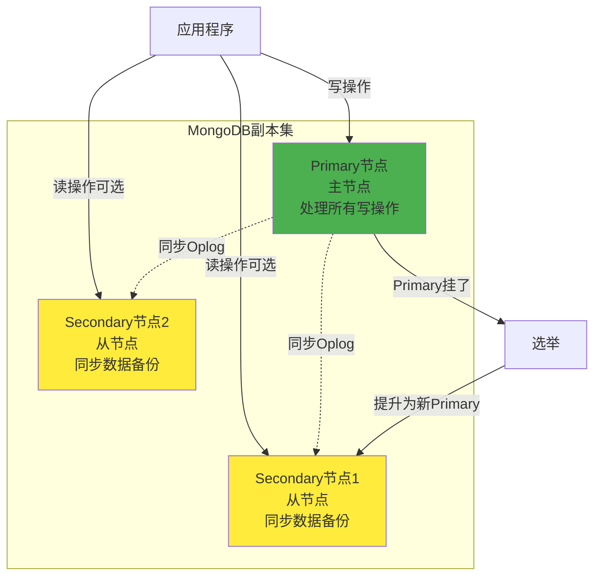
```mermaid
graph TB
    subgraph "MongoDB副本集"
        P[Primary节点<br/>主节点<br/>处理所有写操作]
        S1[Secondary节点1<br/>从节点<br/>同步数据备份]
        S2[Secondary节点2<br/>从节点<br/>同步数据备份]
    end
    
    Client[应用程序] -->|写操作| P
    Client -->|读操作可选| S1
    Client -->|读操作可选| S2
    
    P -.->|同步Oplog| S1
    P -.->|同步Oplog| S2
    
    P -->|Primary挂了| X[选举]
    X -->|提升为新Primary| S1
    
    style P fill:#4caf50
    style S1 fill:#ffeb3b
    style S2 fill:#ffeb3b
```

#### 副本集配置

```javascript
// 初始化副本集
rs.initiate({
    _id: "myReplicaSet",
    members: [
        { _id:  0, host: "mongo1:27017" },
        { _id: 1, host: "mongo2:27017" },
        { _id: 2, host: "mongo3:27017" }
    ]
});

// 查看副本集状态
rs.status();

// 添加节点
rs.add("mongo4:27017");

// 设置优先级（数字越大越容易成为Primary）
cfg = rs.conf();
cfg.members[1].priority = 2;
rs.reconfig(cfg);
```

#### Java连接副本集

```java
// Spring Boot配置
spring: 
  data:
    mongodb:
      uri: mongodb://mongo1:27017,mongo2:27017,mongo3:27017/mydb? replicaSet=myReplicaSet&readPreference=secondaryPreferred

// 代码示例
@Autowired
private MongoTemplate mongoTemplate;

// 写操作（自动发送到Primary）
public void saveProduct(Product product) {
    mongoTemplate.save(product);
}

// 读操作（可以从Secondary读取，减轻Primary压力）
@ReadPreference(ReadPreferenceType.SECONDARY_PREFERRED)
public List<Product> findProducts(String category) {
    Query query = new Query(Criteria. where("category").is(category));
    return mongoTemplate.find(query, Product.class);
}
```

---

### 6. **分片集群（Sharding）水平扩展**

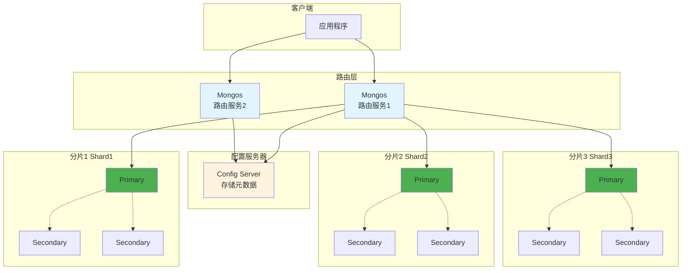
```mermaid
graph TB
    subgraph "客户端"
        App[应用程序]
    end
    
    subgraph "路由层"
        Mongos1[Mongos<br/>路由服务1]
        Mongos2[Mongos<br/>路由服务2]
    end
    
    subgraph "配置服务器"
        Config[Config Server<br/>存储元数据]
    end
    
    subgraph "分片1 Shard1"
        S1P[Primary]
        S1S1[Secondary]
        S1S2[Secondary]
    end
    
    subgraph "分片2 Shard2"
        S2P[Primary]
        S2S1[Secondary]
        S2S2[Secondary]
    end
    
    subgraph "分片3 Shard3"
        S3P[Primary]
        S3S1[Secondary]
        S3S2[Secondary]
    end
    
    App --> Mongos1
    App --> Mongos2
    
    Mongos1 --> Config
    Mongos2 --> Config
    
    Mongos1 --> S1P
    Mongos1 --> S2P
    Mongos1 --> S3P
    
    S1P -.-> S1S1
    S1P -.-> S1S2
    S2P -.-> S2S1
    S2P -.-> S2S2
    S3P -.-> S3S1
    S3P -.-> S3S2
    
    style Mongos1 fill:#e1f5ff
    style Mongos2 fill:#e1f5ff
    style Config fill:#fff3e0
    style S1P fill:#4caf50
    style S2P fill:#4caf50
    style S3P fill:#4caf50
```

#### 分片策略

```javascript
// 1. 启用分片
sh.enableSharding("mydb");

// 2. 创建分片键索引
db.products.createIndex({ category: 1, _id: 1 });

// 3. 对集合进行分片
sh.shardCollection("mydb. products", { category: 1, _id: 1 });

// 数据分布示例：
// Shard1: category = "手机"
// Shard2: category = "平板"
// Shard3: category = "配件"

// 查看分片状态
sh.status();
```

---

## 六、Apollo 配置中心深度解析

### 1. **核心概念**

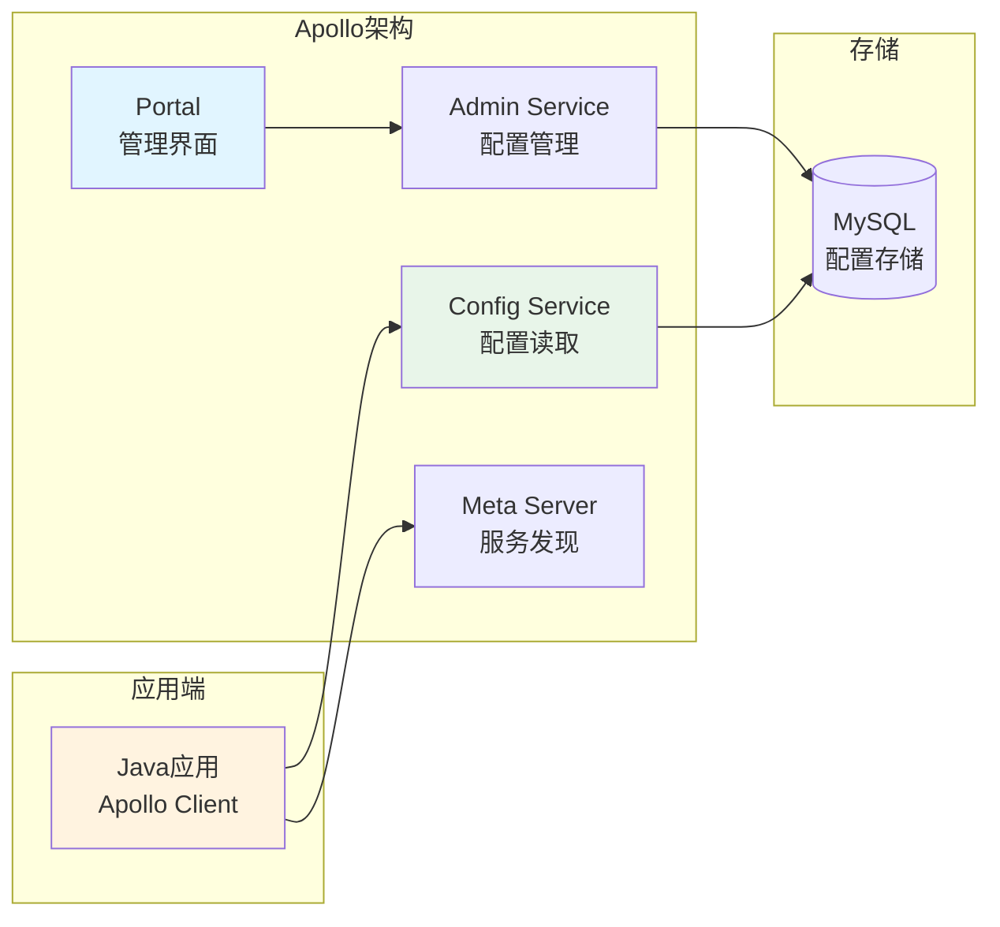
```mermaid
graph LR
    subgraph "Apollo架构"
        Portal[Portal<br/>管理界面]
        AdminService[Admin Service<br/>配置管理]
        ConfigService[Config Service<br/>配置读取]
        MetaServer[Meta Server<br/>服务发现]
    end
    
    subgraph "存储"
        MySQL[(MySQL<br/>配置存储)]
    end
    
    subgraph "应用端"
        Client[Java应用<br/>Apollo Client]
    end
    
    Portal --> AdminService
    AdminService --> MySQL
    ConfigService --> MySQL
    Client --> ConfigService
    Client --> MetaServer
    
    style Portal fill:#e1f5ff
    style ConfigService fill:#e8f5e9
    style Client fill:#fff3e0
```

---

### 2. **配置管理实战**

#### 创建配置

```properties
# application命名空间（公共配置）
app.name=my-service
server.port=8080

# database命名空间（数据库配置）
spring.datasource.url=jdbc:mysql://localhost:3306/mydb
spring.datasource.username=root
spring.datasource. password=123456
spring.datasource.driver-class-name=com.mysql.cj.jdbc.Driver

# redis命名空间（Redis配置）
spring.redis. host=localhost
spring.redis. port=6379
spring.redis.database=0
```

#### Java集成

```java
// 1. 添加依赖
<dependency>
    <groupId>com.ctrip.framework.apollo</groupId>
    <artifactId>apollo-client</artifactId>
    <version>2.0.1</version>
</dependency>

// 2. 配置文件
# application.properties
app.id=my-service
apollo.meta=http://apollo-config-server:8080
apollo.bootstrap. enabled=true
apollo.bootstrap.namespaces=application,database,redis

// 3. 启动类
@SpringBootApplication
@EnableApolloConfig
public class Application {
    public static void main(String[] args) {
        SpringApplication.run(Application.class, args);
    }
}

// 4. 使用配置
@Service
public class UserService {
    // 方式1：@Value注解
    @Value("${server.port:8080}")
    private int port;
    
    // 方式2：@ConfigurationProperties
    @Autowired
    private DataSourceProperties dataSourceProperties;
    
    // 方式3：监听配置变化
    @ApolloConfigChangeListener
    public void onChange(ConfigChangeEvent changeEvent) {
        for (String key : changeEvent.changedKeys()) {
            ConfigChange change = changeEvent.getChange(key);
            log.info("配置变化: {} - 旧值: {}, 新值: {}",
                key, change.getOldValue(), change.getNewValue());
            
            // 根据配置变化执行业务逻辑
            if ("max. pool.size".equals(key)) {
                updateThreadPool(Integer.parseInt(change.getNewValue()));
            }
        }
    }
}

@ConfigurationProperties(prefix = "spring.datasource")
@Data
public class DataSourceProperties {
    private String url;
    private String username;
    private String password;
}
```

---

### 3. **灰度发布**

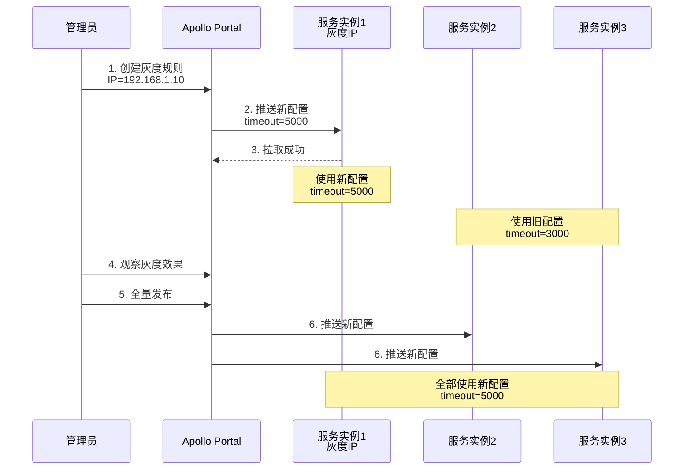
```mermaid
sequenceDiagram
    participant Admin as 管理员
    participant Portal as Apollo Portal
    participant S1 as 服务实例1<br/>灰度IP
    participant S2 as 服务实例2
    participant S3 as 服务实例3
    
    Admin->>Portal: 1. 创建灰度规则<br/>IP=192.168.1.10
    Portal->>S1: 2. 推送新配置<br/>timeout=5000
    S1-->>Portal: 3. 拉取成功
    
    Note over S1: 使用新配置<br/>timeout=5000
    Note over S2,S3: 使用旧配置<br/>timeout=3000
    
    Admin->>Portal: 4. 观察灰度效果
    
    Admin->>Portal: 5. 全量发布
    Portal->>S2: 6. 推送新配置
    Portal->>S3: 6. 推送新配置
    
    Note over S1,S3: 全部使用新配置<br/>timeout=5000
```

**操作步骤**：
1. Portal界面点击"创建灰度"
2. 输入灰度IP：`192.168.1.10`
3. 修改配置值
4. 点击"灰度发布"
5. 观察灰度机器的日志和监控
6. 确认无问题后点击"全量发布"
7. 或发现问题点击"放弃灰度"

---

### 4. **多环境管理**

```
项目结构：
my-service
  ├── DEV（开发环境）
  │   ├── application
  │   │   └── spring.profiles.active=dev
  │   └── database
  │       └── spring. datasource.url=jdbc:mysql://dev-db:3306/mydb
  │
  ├── FAT（测试环境）
  │   ├── application
  │   │   └── spring.profiles. active=fat
  │   └── database
  │       └── spring.datasource.url=jdbc:mysql://test-db:3306/mydb
  │
  └── PROD（生产环境）
      ├── application
      │   └── spring.profiles.active=prod
      └── database
          └── spring.datasource.url=jdbc:mysql://prod-db:3306/mydb
```

**配置方式**：
```bash
# 开发环境
java -jar app.jar -Denv=DEV

# 生产环境
java -jar app.jar -Denv=PROD
```

---

## 七、Docker 深度解析

### 1. **Docker核心概念**

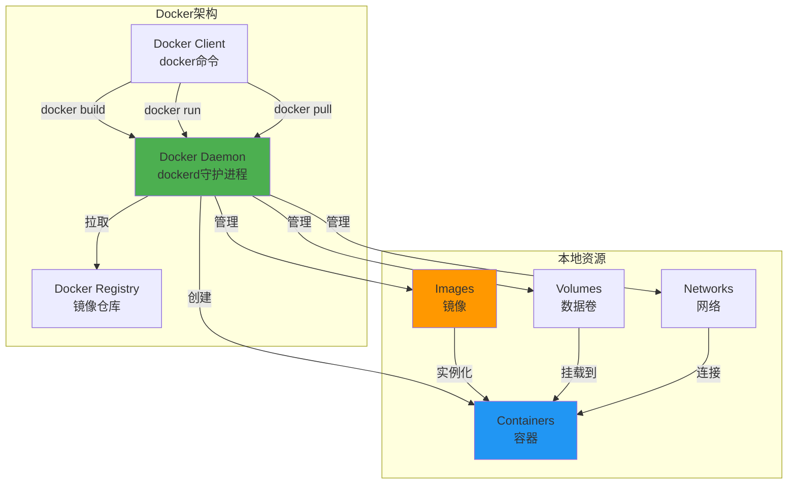
```mermaid
graph TB
    subgraph "Docker架构"
        Client[Docker Client<br/>docker命令]
        Daemon[Docker Daemon<br/>dockerd守护进程]
        Registry[Docker Registry<br/>镜像仓库]
    end
    
    subgraph "本地资源"
        Images[Images<br/>镜像]
        Containers[Containers<br/>容器]
        Volumes[Volumes<br/>数据卷]
        Networks[Networks<br/>网络]
    end
    
    Client -->|docker build| Daemon
    Client -->|docker run| Daemon
    Client -->|docker pull| Daemon
    
    Daemon -->|创建| Containers
    Daemon -->|拉取| Registry
    Daemon -->|管理| Images
    Daemon -->|管理| Volumes
    Daemon -->|管理| Networks
    
    Images -->|实例化| Containers
    Volumes -->|挂载到| Containers
    Networks -->|连接| Containers
    
    style Daemon fill:#4caf50
    style Containers fill:#2196f3
    style Images fill:#ff9800
```

---

### 2. **Dockerfile 详解**

```dockerfile
# 基础镜像
FROM openjdk:11-jre-slim

# 维护者信息
LABEL maintainer="your-email@example.com"

# 设置工作目录
WORKDIR /app

# 复制文件
COPY target/my-service.jar /app/app.jar

# 设置环境变量
ENV JAVA_OPTS="-Xms512m -Xmx1024m" \
    APP_ENV=prod \
    TZ=Asia/Shanghai

# 暴露端口
EXPOSE 8080

# 健康检查
HEALTHCHECK --interval=30s --timeout=3s --retries=3 \
    CMD curl -f http://localhost:8080/actuator/health || exit 1

# 启动命令
ENTRYPOINT ["sh", "-c", "java $JAVA_OPTS -jar /app/app.jar"]
```

#### 多阶段构建（减小镜像大小）

```dockerfile
# 阶段1：构建
FROM maven:3.8-openjdk-11 AS builder
WORKDIR /build
COPY pom.xml . 
COPY src ./src
RUN mvn clean package -DskipTests

# 阶段2：运行
FROM openjdk:11-jre-slim
WORKDIR /app
COPY --from=builder /build/target/*. jar app.jar
EXPOSE 8080
ENTRYPOINT ["java", "-jar", "app.jar"]

# 最终镜像只包含JRE和jar包，不包含Maven和源代码
# 镜像大小：从800MB降到200MB
```

---

### 3. **构建和运行**

```bash
# 构建镜像
docker build -t my-service:1.0.0 .

# 查看镜像
docker images

# 运行容器
docker run -d \
    --name my-service \
    -p 8080:8080 \
    -e SPRING_PROFILES_ACTIVE=prod \
    -e JAVA_OPTS="-Xms512m -Xmx1024m" \
    -v /data/logs:/app/logs \
    --restart=always \
    my-service: 1.0.0

# 参数说明：
# -d:  后台运行
# --name:  容器名称
# -p: 端口映射（宿主机:容器）
# -e: 环境变量
# -v: 数据卷挂载（宿主机:容器）
# --restart: 重启策略

# 查看运行中的容器
docker ps

# 查看容器日志
docker logs -f my-service

# 进入容器
docker exec -it my-service /bin/bash

# 停止容器
docker stop my-service

# 删除容器
docker rm my-service

# 删除镜像
docker rmi my-service:1.0.0
```

---

### 4. **Docker 网络**

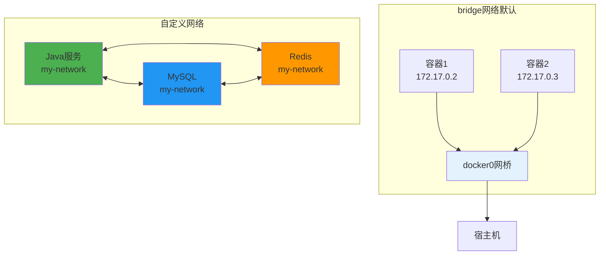
```mermaid
graph TB
    subgraph "bridge网络默认"
        C1[容器1<br/>172.17.0.2]
        C2[容器2<br/>172.17.0.3]
        Bridge[docker0网桥]
    end
    
    subgraph "自定义网络"
        C3[Java服务<br/>my-network]
        C4[MySQL<br/>my-network]
        C5[Redis<br/>my-network]
    end
    
    C1 --> Bridge
    C2 --> Bridge
    Bridge --> Host[宿主机]
    
    C3 <--> C4
    C3 <--> C5
    C4 <--> C5
    
    style Bridge fill:#e3f2fd
    style C3 fill:#4caf50
    style C4 fill:#2196f3
    style C5 fill:#ff9800
```

```bash
# 创建自定义网络
docker network create my-network

# 运行容器并加入网络
docker run -d --name mysql --network my-network \
    -e MYSQL_ROOT_PASSWORD=123456 \
    mysql:8.0

docker run -d --name redis --network my-network \
    redis:7.0

docker run -d --name my-service --network my-network \
    -p 8080:8080 \
    -e DB_HOST=mysql \
    -e REDIS_HOST=redis \
    my-service:1.0.0

# 在my-service中可以直接通过主机名访问：
# jdbc:mysql://mysql:3306/mydb
# redis://redis:6379
```

---

### 5. **Docker Compose（容器编排）**

```yaml
# docker-compose.yml
version: '3.8'

services:
  # MySQL服务
  mysql:
    image: mysql:8.0
    container_name: my-mysql
    environment:
      MYSQL_ROOT_PASSWORD: root123
      MYSQL_DATABASE: mydb
      TZ: Asia/Shanghai
    ports:
      - "3306:3306"
    volumes: 
      - mysql-data:/var/lib/mysql
      - ./init.sql:/docker-entrypoint-initdb.d/init.sql
    networks:
      - backend
    healthcheck:
      test: ["CMD", "mysqladmin", "ping", "-h", "localhost"]
      interval: 10s
      timeout: 5s
      retries: 3

  # Redis服务
  redis:
    image: redis: 7.0-alpine
    container_name: my-redis
    ports:
      - "6379:6379"
    volumes:
      - redis-data:/data
    networks:
      - backend
    command: redis-server --appendonly yes

  # MongoDB服务
  mongodb:
    image: mongo:6.0
    container_name: my-mongodb
    environment: 
      MONGO_INITDB_ROOT_USERNAME: admin
      MONGO_INITDB_ROOT_PASSWORD: admin123
    ports:
      - "27017:27017"
    volumes: 
      - mongo-data:/data/db
    networks:
      - backend

  # Kafka服务
  zookeeper:
    image: confluentinc/cp-zookeeper:7.5.0
    environment:
      ZOOKEEPER_CLIENT_PORT: 2181
    networks:
      - backend

  kafka:
    image: confluentinc/cp-kafka:7.5.0
    depends_on:
      - zookeeper
    ports:
      - "9092:9092"
    environment: 
      KAFKA_ZOOKEEPER_CONNECT: zookeeper:2181
      KAFKA_ADVERTISED_LISTENERS:  PLAINTEXT://kafka:9092
      KAFKA_OFFSETS_TOPIC_REPLICATION_FACTOR: 1
    networks: 
      - backend

  # Java应用服务
  app:
    build: 
      context: .
      dockerfile: Dockerfile
    image: my-service:latest
    container_name: my-service
    depends_on:
      mysql:
        condition: service_healthy
      redis:
        condition:  service_started
      mongodb:
        condition:  service_started
      kafka:
        condition: service_started
    ports:
      - "8080:8080"
    environment:
      SPRING_PROFILES_ACTIVE:  prod
      DB_HOST: mysql
      DB_PORT: 3306
      REDIS_HOST: redis
      REDIS_PORT: 6379
      MONGO_HOST: mongodb
      MONGO_PORT: 27017
      KAFKA_SERVERS: kafka:9092
    volumes:
      - ./logs:/app/logs
    networks:
      - backend
    restart: unless-stopped

# 数据卷定义
volumes:
  mysql-data:
  redis-data: 
  mongo-data: 

# 网络定义
networks:
  backend: 
    driver: bridge
```

**使用方式**：
```bash
# 启动所有服务
docker-compose up -d

# 查看服务状态
docker-compose ps

# 查看日志
docker-compose logs -f app

# 停止所有服务
docker-compose stop

# 停止并删除容器
docker-compose down

# 停止并删除容器和数据卷
docker-compose down -v

# 重启单个服务
docker-compose restart app

# 扩容（启动多个实例）
docker-compose up -d --scale app=3
```

---

### 6. **数据持久化**

#### 三种挂载方式

```bash
# 1. Volume（推荐）- Docker管理
docker run -d --name mysql \
    -v mysql-data:/var/lib/mysql \
    mysql: 8.0

# 查看Volume
docker volume ls
docker volume inspect mysql-data

# 2. Bind Mount - 挂载宿主机目录
docker run -d --name nginx \
    -v /home/user/html:/usr/share/nginx/html \
    nginx:alpine

# 3. tmpfs - 临时文件系统（内存）
docker run -d --name app \
    --tmpfs /tmp \
    my-service:1.0.0
```

---

### 7. **最佳实践**

#### 优化镜像大小

```dockerfile
# ❌ 不好的做法
FROM ubuntu:latest
RUN apt-get update
RUN apt-get install -y openjdk-11-jdk
RUN apt-get install -y maven
COPY .  /app
RUN cd /app && mvn package
CMD ["java", "-jar", "/app/target/app.jar"]
# 镜像大小：1.2GB

# ✅ 好的做法
FROM openjdk:11-jre-slim
COPY target/app.jar /app. jar
CMD ["java", "-jar", "/app.jar"]
# 镜像大小：200MB

# ✅ 更好的做法（多阶段构建）
FROM maven:3.8-openjdk-11 AS build
WORKDIR /app
COPY pom.xml . 
COPY src ./src
RUN mvn package -DskipTests

FROM openjdk:11-jre-slim
COPY --from=build /app/target/app.jar /app.jar
CMD ["java", "-jar", "/app.jar"]
# 镜像大小：200MB，且构建过程标准化
```

#### 合并RUN指令

```dockerfile
# ❌ 每个RUN创建一个镜像层
RUN apt-get update
RUN apt-get install -y curl
RUN apt-get install -y vim
RUN rm -rf /var/lib/apt/lists/*

# ✅ 合并为一个RUN
RUN apt-get update \
    && apt-get install -y curl vim \
    && rm -rf /var/lib/apt/lists/*
```

#### 使用. dockerignore

```bash
# . dockerignore
target/
. git/
.idea/
*.md
Dockerfile
docker-compose.yml
```

---

## 八、系统监控与运维

### 1. **日志收集架构**

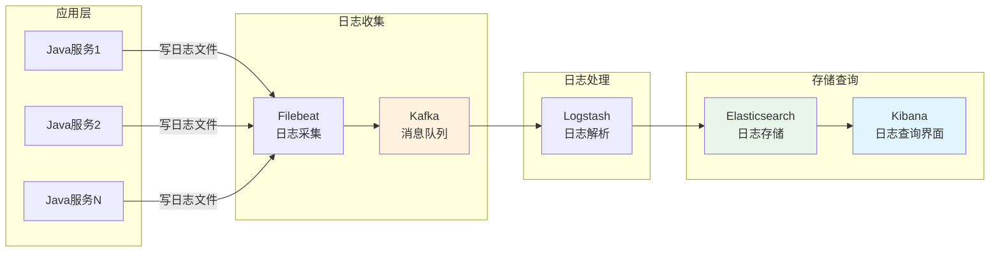
```mermaid
graph LR
    subgraph "应用层"
        App1[Java服务1]
        App2[Java服务2]
        App3[Java服务N]
    end
    
    subgraph "日志收集"
        Filebeat[Filebeat<br/>日志采集]
        Kafka[Kafka<br/>消息队列]
    end
    
    subgraph "日志处理"
        Logstash[Logstash<br/>日志解析]
    end
    
    subgraph "存储查询"
        ES[Elasticsearch<br/>日志存储]
        Kibana[Kibana<br/>日志查询界面]
    end
    
    App1 -->|写日志文件| Filebeat
    App2 -->|写日志文件| Filebeat
    App3 -->|写日志文件| Filebeat
    
    Filebeat --> Kafka
    Kafka --> Logstash
    Logstash --> ES
    ES --> Kibana
    
    style Kafka fill:#fff3e0
    style ES fill:#e8f5e9
    style Kibana fill:#e1f5ff
```

#### Logback配置（输出到文件）

```xml
<!-- logback-spring.xml -->
<?xml version="1.0" encoding="UTF-8"?>
<configuration>
    <!-- 控制台输出 -->
    <appender name="CONSOLE" class="ch.qos.logback.core.ConsoleAppender">
        <encoder>
            <pattern>%d{yyyy-MM-dd HH:mm:ss. SSS} [%thread] %-5level %logger{50} - %msg%n</pattern>
        </encoder>
    </appender>
    
    <!-- 文件输出 -->
    <appender name="FILE" class="ch.qos. logback.core.rolling.RollingFileAppender">
        <file>/app/logs/app.log</file>
        <rollingPolicy class="ch.qos.logback.core.rolling.TimeBasedRollingPolicy">
            <!-- 每天生成一个日志文件 -->
            <fileNamePattern>/app/logs/app. %d{yyyy-MM-dd}.log</fileNamePattern>
            <!-- 保留30天 -->
            <maxHistory>30</maxHistory>
        </rollingPolicy>
        <encoder>
            <!-- JSON格式，方便ELK解析 -->
            <pattern>{"time": "%d{yyyy-MM-dd HH:mm:ss.SSS}","level":"%level","thread":"%thread","class":"%logger{40}","message":"%msg"}%n</pattern>
        </encoder>
    </appender>
    
    <!-- Kafka输出（直接发送到Kafka） -->
    <appender name="KAFKA" class="com.github.danielwegener.logback.kafka.KafkaAppender">
        <encoder class="ch.qos.logback.classic.encoder.PatternLayoutEncoder">
            <pattern>{"time":"%d{yyyy-MM-dd HH:mm:ss. SSS}","level":"%level","message":"%msg"}%n</pattern>
        </encoder>
        <topic>app-logs</topic>
        <keyingStrategy class="com.github.danielwegener. logback.kafka.keying.NoKeyKeyingStrategy"/>
        <deliveryStrategy class="com.github.danielwegener.logback.kafka. delivery.AsynchronousDeliveryStrategy"/>
        <producerConfig>bootstrap.servers=kafka:9092</producerConfig>
    </appender>
    
    <root level="INFO">
        <appender-ref ref="CONSOLE"/>
        <appender-ref ref="FILE"/>
        <appender-ref ref="KAFKA"/>
    </root>
</configuration>
```

---

### 2. **监控体系**

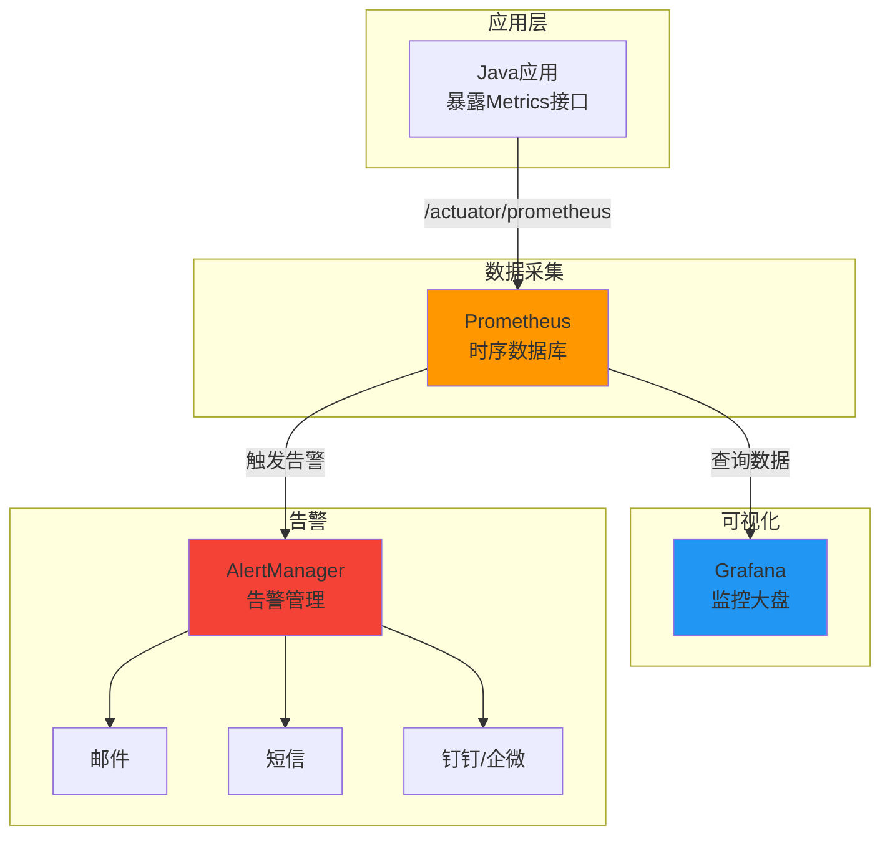
```mermaid
graph TB
    subgraph "应用层"
        App[Java应用<br/>暴露Metrics接口]
    end
    
    subgraph "数据采集"
        Prometheus[Prometheus<br/>时序数据库]
    end
    
    subgraph "可视化"
        Grafana[Grafana<br/>监控大盘]
    end
    
    subgraph "告警"
        AlertManager[AlertManager<br/>告警管理]
        Email[邮件]
        SMS[短信]
        Webhook[钉钉/企微]
    end
    
    App -->|/actuator/prometheus| Prometheus
    Prometheus -->|查询数据| Grafana
    Prometheus -->|触发告警| AlertManager
    AlertManager --> Email
    AlertManager --> SMS
    AlertManager --> Webhook
    
    style Prometheus fill:#ff9800
    style Grafana fill:#2196f3
    style AlertManager fill:#f44336
```

#### Spring Boot Actuator集成

```xml
<!-- pom.xml -->
<dependency>
    <groupId>org.springframework.boot</groupId>
    <artifactId>spring-boot-starter-actuator</artifactId>
</dependency>
<dependency>
    <groupId>io.micrometer</groupId>
    <artifactId>micrometer-registry-prometheus</artifactId>
</dependency>
```

```yaml
# application.yml
management:
  endpoints:
    web: 
      exposure:
        include:  health,info,prometheus,metrics
  metrics:
    tags:
      application:  ${spring.application.name}
    export:
      prometheus:
        enabled: true
```

#### 自定义指标

```java
@Component
public class CustomMetrics {
    private final MeterRegistry meterRegistry;
    
    public CustomMetrics(MeterRegistry meterRegistry) {
        this.meterRegistry = meterRegistry;
    }
    
    // 计数器（累计值）
    public void recordOrder() {
        meterRegistry.counter("order.created", "status", "success").increment();
    }
    
    // 计时器（统计耗时）
    public void recordApiDuration(String api, long duration) {
        meterRegistry.timer("api.duration", "path", api)
            .record(duration, TimeUnit.MILLISECONDS);
    }
    
    // 仪表盘（当前值）
    @PostConstruct
    public void init() {
        meterRegistry.gauge("thread.pool.active", threadPoolExecutor, ThreadPoolExecutor::getActiveCount);
    }
}

// 使用示例
@Service
public class OrderService {
    @Autowired
    private CustomMetrics customMetrics;
    
    public void createOrder(Order order) {
        long start = System.currentTimeMillis();
        
        try {
            // 业务逻辑
            orderDao.save(order);
            
            // 记录成功
            customMetrics.recordOrder();
        } finally {
            // 记录耗时
            customMetrics.recordApiDuration("/api/order/create", 
                System.currentTimeMillis() - start);
        }
    }
}
```

#### Prometheus配置

```yaml
# prometheus.yml
global:
  scrape_interval: 15s  # 每15秒采集一次

scrape_configs:
  # 采集Java应用
  - job_name: 'my-service'
    metrics_path: '/actuator/prometheus'
    static_configs: 
      - targets: ['my-service:8080']
  
  # 采集MySQL
  - job_name: 'mysql'
    static_configs:
      - targets: ['mysql-exporter:9104']
  
  # 采集Redis
  - job_name: 'redis'
    static_configs: 
      - targets: ['redis-exporter:9121']
```

#### Grafana Dashboard配置

**常见监控指标**：
```promql
# JVM内存使用率
jvm_memory_used_bytes{area="heap"} / jvm_memory_max_bytes{area="heap"} * 100

# CPU使用率
process_cpu_usage * 100

# QPS（每秒请求数）
rate(http_server_requests_seconds_count[1m])

# 接口平均响应时间
rate(http_server_requests_seconds_sum[1m]) / rate(http_server_requests_seconds_count[1m])

# 错误率
rate(http_server_requests_seconds_count{status=~"5.."}[1m]) / rate(http_server_requests_seconds_count[1m]) * 100

# 线程池队列大小
thread_pool_queue_size

# 数据库连接池使用率
hikaricp_connections_active / hikaricp_connections_max * 100
```

---

### 3. **告警规则**

```yaml
# alert_rules.yml
groups:
  - name: application_alerts
    interval: 30s
    rules:
      # CPU使用率超过80%
      - alert:  HighCPUUsage
        expr: process_cpu_usage * 100 > 80
        for: 5m
        labels:
          severity: warning
        annotations:
          summary: "CPU使用率过高"
          description: "{{ $labels.instance }} CPU使用率 {{ $value }}%"
      
      # 内存使用率超过85%
      - alert: HighMemoryUsage
        expr:  jvm_memory_used_bytes{area="heap"} / jvm_memory_max_bytes{area="heap"} * 100 > 85
        for: 5m
        labels:
          severity: warning
        annotations: 
          summary: "内存使用率过高"
      
      # 接口错误率超过5%
      - alert: HighErrorRate
        expr: rate(http_server_requests_seconds_count{status=~"5.."}[5m]) / rate(http_server_requests_seconds_count[5m]) * 100 > 5
        for: 2m
        labels:
          severity: critical
        annotations:
          summary: "接口错误率过高"
          description: "错误率 {{ $value }}%"
      
      # 服务宕机
      - alert: ServiceDown
        expr: up{job="my-service"} == 0
        for: 1m
        labels:
          severity: critical
        annotations:
          summary: "服务宕机"
          description: "{{ $labels.instance }} 已宕机超过1分钟"
```

---

### 4. **链路追踪（分布式追踪）**

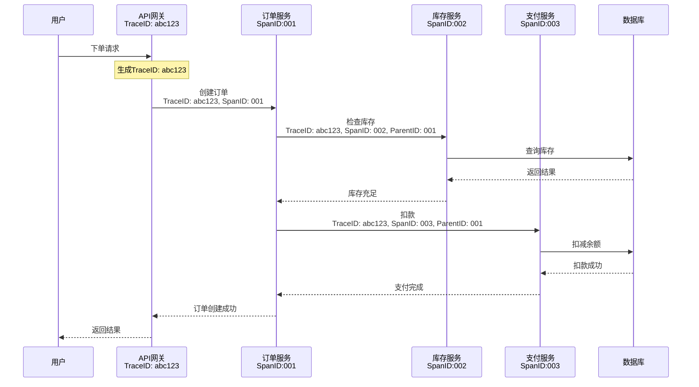
```mermaid
sequenceDiagram
    participant User as 用户
    participant Gateway as API网关<br/>TraceID: abc123
    participant OrderService as 订单服务<br/>SpanID:001
    participant InventoryService as 库存服务<br/>SpanID:002
    participant PaymentService as 支付服务<br/>SpanID:003
    participant DB as 数据库
    
    User->>Gateway:  下单请求
    Note over Gateway: 生成TraceID:  abc123
    
    Gateway->>OrderService: 创建订单<br/>TraceID:  abc123, SpanID:  001
    OrderService->>InventoryService: 检查库存<br/>TraceID: abc123, SpanID:  002, ParentID: 001
    InventoryService->>DB: 查询库存
    DB-->>InventoryService: 返回结果
    InventoryService-->>OrderService: 库存充足
    
    OrderService->>PaymentService: 扣款<br/>TraceID: abc123, SpanID:  003, ParentID: 001
    PaymentService->>DB: 扣减余额
    DB-->>PaymentService:  扣款成功
    PaymentService-->>OrderService: 支付完成
    
    OrderService-->>Gateway: 订单创建成功
    Gateway-->>User: 返回结果
```

#### Spring Cloud Sleuth + Zipkin

```xml
<!-- pom.xml -->
<dependency>
    <groupId>org.springframework.cloud</groupId>
    <artifactId>spring-cloud-starter-sleuth</artifactId>
</dependency>
<dependency>
    <groupId>org.springframework. cloud</groupId>
    <artifactId>spring-cloud-sleuth-zipkin</artifactId>
</dependency>
```

```yaml
# application.yml
spring:
  sleuth:
    sampler:
      probability: 1.0  # 采样率100%（生产环境建议0.1）
  zipkin:
    base-url: http://zipkin-server:9411
    sender:
      type: web
```

**查看链路**：
- 访问 `http://zipkin-server:9411`
- 输入 TraceID 查看完整调用链
- 可以看到每个服务的耗时、是否出错

---

### 5. **健康检查**

```java
// 自定义健康检查
@Component
public class CustomHealthIndicator implements HealthIndicator {
    @Autowired
    private RedisTemplate redisTemplate;
    
    @Autowired
    private KafkaTemplate kafkaTemplate;
    
    @Override
    public Health health() {
        // 检查Redis连接
        try {
            redisTemplate.opsForValue().get("health-check");
        } catch (Exception e) {
            return Health.down()
                .withDetail("redis", "连接失败:  " + e.getMessage())
                .build();
        }
        
        // 检查Kafka连接
        // ... 
        
        // 检查数据库连接池
        HikariDataSource dataSource = getDataSource();
        int activeConnections = dataSource.getHikariPoolMXBean().getActiveConnections();
        int maxConnections = dataSource.getMaximumPoolSize();
        
        if (activeConnections > maxConnections * 0.9) {
            return Health.down()
                .withDetail("database", "连接池即将耗尽")
                .withDetail("active", activeConnections)
                .withDetail("max", maxConnections)
                .build();
        }
        
        return Health. up()
            .withDetail("redis", "正常")
            .withDetail("kafka", "正常")
            .withDetail("database", "正常")
            .build();
    }
}
```

**访问健康检查接口**：
```bash
curl http://localhost:8080/actuator/health

# 返回：
{
  "status": "UP",
  "components": {
    "custom": {
      "status": "UP",
      "details": {
        "redis": "正常",
        "kafka": "正常",
        "database": "正常"
      }
    },
    "diskSpace": {
      "status":  "UP",
      "details":  {
        "total": 500000000000,
        "free": 200000000000
      }
    }
  }
}
```

---

### 6. **完整的Docker Compose运维配置**

```yaml
version: '3.8'

services:
  # 应用服务
  app:
    image: my-service:latest
    deploy:
      replicas: 3  # 3个实例
      resources: 
        limits:
          cpus: '2'
          memory: 2G
        reservations:
          cpus: '1'
          memory: 1G
    healthcheck:
      test: ["CMD", "curl", "-f", "http://localhost:8080/actuator/health"]
      interval:  30s
      timeout: 10s
      retries: 3
      start_period: 60s
    logging:
      driver: "json-file"
      options:
        max-size: "100m"
        max-file: "3"
    environment:
      JAVA_OPTS: "-Xms1g -Xmx2g -XX:+UseG1GC"
  
  # Prometheus
  prometheus:
    image: prom/prometheus: latest
    ports:
      - "9090:9090"
    volumes:
      - ./prometheus.yml:/etc/prometheus/prometheus.yml
      - prometheus-data:/prometheus
    command:
      - '--config. file=/etc/prometheus/prometheus. yml'
      - '--storage. tsdb.path=/prometheus'
  
  # Grafana
  grafana:
    image: grafana/grafana:latest
    ports:
      - "3000:3000"
    volumes:
      - grafana-data:/var/lib/grafana
    environment:
      GF_SECURITY_ADMIN_PASSWORD: admin123
  
  # Zipkin
  zipkin:
    image: openzipkin/zipkin:latest
    ports: 
      - "9411:9411"
  
  # Filebeat
  filebeat:
    image: docker.elastic.co/beats/filebeat:8.10.0
    volumes:
      - ./filebeat. yml:/usr/share/filebeat/filebeat.yml
      - /var/lib/docker/containers:/var/lib/docker/containers: ro
      - /var/run/docker.sock:/var/run/docker.sock:ro
    depends_on:
      - kafka

volumes:
  prometheus-data: 
  grafana-data: 
```

---
