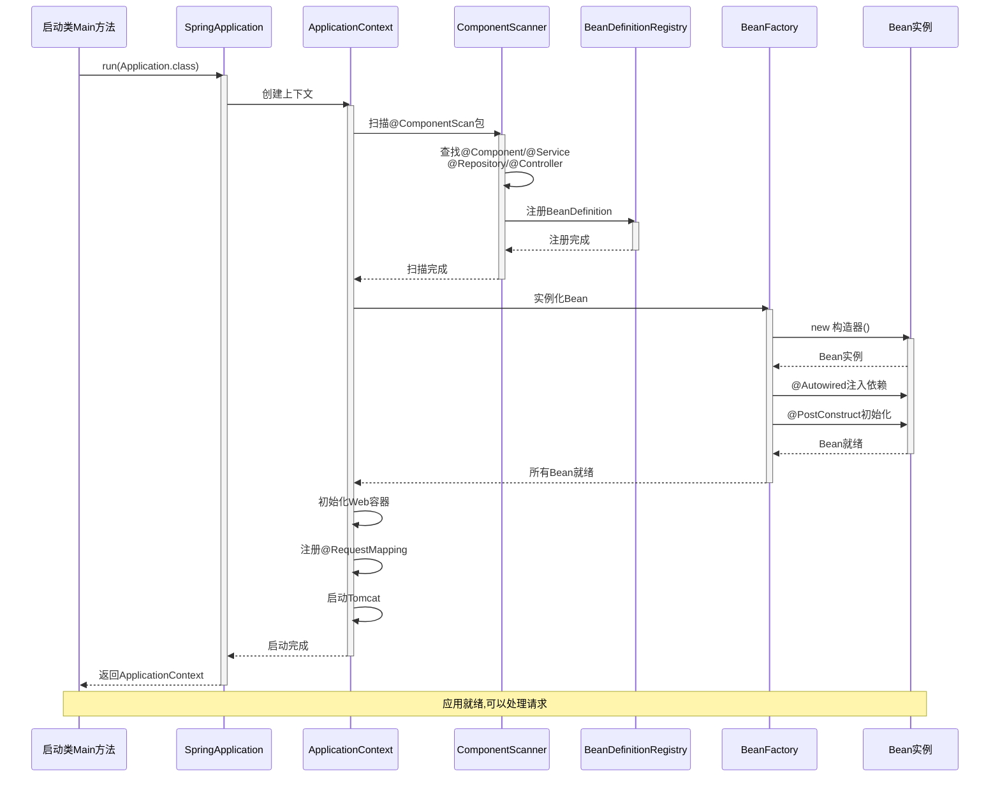
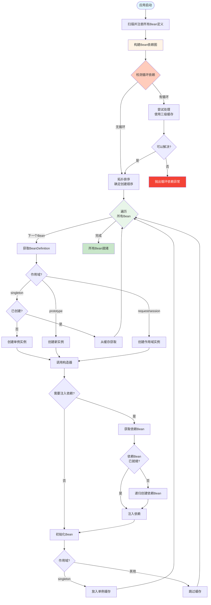
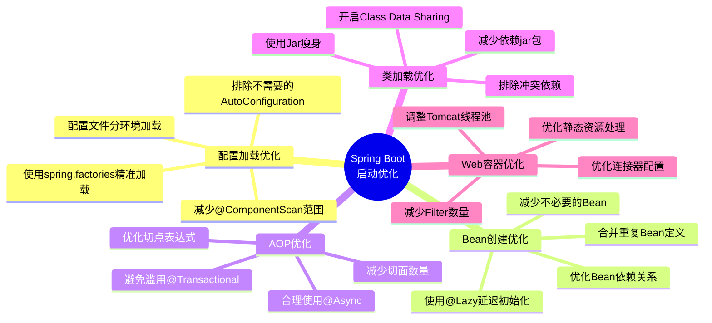

## 1. 完整启动流程

```mermaid
flowchart TD
    Start([应用启动入口<br/>SpringApplication.run]) --> CreateContext[创建Spring应用上下文<br/>ApplicationContext]
    
    CreateContext --> ConfigPhase[配置阶段]
    
    ConfigPhase --> LoadConfig[加载配置文件<br/>application.properties/yml]
    LoadConfig --> ComponentScan[组件扫描<br/>@ComponentScan]
    ComponentScan --> RegisterBean[注册BeanDefinition<br/>到BeanDefinitionRegistry]
    RegisterBean --> BeanFactoryPost[BeanFactoryPostProcessor执行<br/>可修改BeanDefinition]
    
    BeanFactoryPost --> InstantiationPhase[实例化阶段]
    
    InstantiationPhase --> CreateBean[实例化Bean<br/>调用构造器]
    CreateBean --> InjectDep[属性填充<br/>@Autowired依赖注入]
    InjectDep --> AwareCallback[Aware接口回调<br/>BeanNameAware等]
    AwareCallback --> BeanPostBefore[BeanPostProcessor<br/>前置处理]
    BeanPostBefore --> InitMethod[初始化方法<br/>@PostConstruct]
    InitMethod --> BeanPostAfter[BeanPostProcessor<br/>后置处理 AOP代理]
    BeanPostAfter --> BeanReady[Bean就绪<br/>放入单例池]
    
    BeanReady --> WebInit[Web容器初始化]
    
    WebInit --> DispatcherInit[DispatcherServlet初始化]
    DispatcherInit --> HandlerMapping[HandlerMapping初始化<br/>扫描@RequestMapping]
    HandlerMapping --> HandlerAdapter[HandlerAdapter初始化]
    HandlerAdapter --> ExceptionHandler[异常处理器初始化<br/>@ControllerAdvice]
    
    ExceptionHandler --> TomcatStart[内嵌Tomcat启动<br/>监听端口8080]
    
    TomcatStart --> AppReady[应用就绪<br/>ApplicationReadyEvent]
    
    AppReady --> HandleRequest[处理HTTP请求]
    
    style Start fill:#e1f5ff
    style CreateContext fill:#fff4e6
    style ConfigPhase fill:#e8f5e9
    style InstantiationPhase fill:#fce4ec
    style WebInit fill:#f3e5f5
    style AppReady fill:#e0f2f1
    style HandleRequest fill:#fff9c4
```

## 2. Bean生命周期详细流程

```mermaid
flowchart TD
    Start([Bean生命周期开始]) --> Constructor[① 实例化<br/>调用构造器]
    
    Constructor --> SetProperties[② 属性填充<br/>@Autowired注入依赖]
    
    SetProperties --> BeanNameAware{实现了<br/>BeanNameAware?}
    BeanNameAware -->|是| SetBeanName[setBeanName]
    BeanNameAware -->|否| BeanFactoryAware
    SetBeanName --> BeanFactoryAware
    
    BeanFactoryAware{实现了<br/>BeanFactoryAware?}
    BeanFactoryAware -->|是| SetBeanFactory[setBeanFactory]
    BeanFactoryAware -->|否| AppContextAware
    SetBeanFactory --> AppContextAware
    
    AppContextAware{实现了<br/>ApplicationContextAware?}
    AppContextAware -->|是| SetAppContext[setApplicationContext]
    AppContextAware -->|否| PreInit
    SetAppContext --> PreInit
    
    PreInit[③ BeanPostProcessor<br/>postProcessBeforeInitialization] --> PostConstruct{有@PostConstruct<br/>方法?}
    
    PostConstruct -->|是| CallPostConstruct[调用@PostConstruct方法]
    PostConstruct -->|否| InitializingBean
    CallPostConstruct --> InitializingBean
    
    InitializingBean{实现了<br/>InitializingBean?}
    InitializingBean -->|是| AfterPropertiesSet[afterPropertiesSet]
    InitializingBean -->|否| CustomInit
    AfterPropertiesSet --> CustomInit
    
    CustomInit{有自定义<br/>init-method?}
    CustomInit -->|是| CallInitMethod[调用init-method]
    CustomInit -->|否| PostInit
    CallInitMethod --> PostInit
    
    PostInit[④ BeanPostProcessor<br/>postProcessAfterInitialization<br/>AOP代理创建] --> Ready[⑤ Bean就绪<br/>可以使用]
    
    Ready --> Usage[Bean被使用中...]
    
    Usage --> Shutdown{应用关闭?}
    Shutdown -->|否| Usage
    Shutdown -->|是| Destroy[销毁流程开始]
    
    Destroy --> PreDestroy{有@PreDestroy<br/>方法?}
    PreDestroy -->|是| CallPreDestroy[调用@PreDestroy方法]
    PreDestroy -->|否| DisposableBean
    CallPreDestroy --> DisposableBean
    
    DisposableBean{实现了<br/>DisposableBean?}
    DisposableBean -->|是| CallDestroy[destroy方法]
    DisposableBean -->|否| CustomDestroy
    CallDestroy --> CustomDestroy
    
    CustomDestroy{有自定义<br/>destroy-method?}
    CustomDestroy -->|是| CallDestroyMethod[调用destroy-method]
    CustomDestroy -->|否| End
    CallDestroyMethod --> End([Bean销毁完成])
    
    style Start fill:#e1f5ff
    style Constructor fill:#fff4e6
    style SetProperties fill:#e8f5e9
    style Ready fill:#c8e6c9
    style Usage fill:#fff9c4
    style Destroy fill:#ffccbc
    style End fill:#cfd8dc
```

## 3. HTTP请求处理流程

```mermaid
flowchart TD
    Client[浏览器/客户端] -->|HTTP Request| Tomcat[Tomcat接收请求]
    
    Tomcat --> Dispatcher[DispatcherServlet<br/>doDispatch方法]
    
    Dispatcher --> FindHandler[HandlerMapping<br/>查找处理器]
    FindHandler --> MatchURL{匹配到<br/>@RequestMapping?}
    
    MatchURL -->|是| GetChain[获取HandlerExecutionChain]
    MatchURL -->|否| NotFound[返回404]
    
    GetChain --> PreHandle[拦截器前置处理<br/>Interceptor.preHandle]
    
    PreHandle --> PreSuccess{前置处理<br/>成功?}
    PreSuccess -->|否| InterceptorFail[返回错误]
    PreSuccess -->|是| Adapter[HandlerAdapter<br/>调用Controller]
    
    Adapter --> ParseParam[参数解析<br/>@RequestParam/@RequestBody]
    ParseParam --> Validate{需要<br/>@Validated?}
    
    Validate -->|是| DoValidate[执行参数校验]
    Validate -->|否| InvokeController
    
    DoValidate --> ValidResult{校验通过?}
    ValidResult -->|否| ValidError[抛出校验异常]
    ValidResult -->|是| InvokeController
    
    InvokeController[调用Controller方法] --> CallService[Controller调用Service]
    CallService --> ServiceLogic[Service执行业务逻辑<br/>单例Bean实例]
    ServiceLogic --> CallRepo[Service调用Repository]
    CallRepo --> DBAccess[访问数据库]
    
    DBAccess --> ReturnData[返回数据]
    ReturnData --> PostHandle[拦截器后置处理<br/>Interceptor.postHandle]
    
    PostHandle --> ProcessResult{返回类型?}
    
    ProcessResult -->|@ResponseBody| JsonConvert[HttpMessageConverter<br/>序列化为JSON]
    ProcessResult -->|View| ViewRender[视图渲染]
    
    JsonConvert --> AfterCompletion
    ViewRender --> AfterCompletion
    
    AfterCompletion[拦截器完成处理<br/>Interceptor.afterCompletion] --> Response[返回HTTP Response]
    
    Response --> Client
    
    ValidError --> ExceptionHandle[全局异常处理<br/>@ExceptionHandler]
    InterceptorFail --> ExceptionHandle
    
    ExceptionHandle --> ErrorResponse[返回错误响应]
    ErrorResponse --> Client
    
    style Client fill:#e1f5ff
    style Dispatcher fill:#fff4e6
    style InvokeController fill:#e8f5e9
    style ServiceLogic fill:#fce4ec
    style DBAccess fill:#f3e5f5
    style Response fill:#c8e6c9
    style ExceptionHandle fill:#ffccbc
```

## 4. 注解处理时序图



## 5. 依赖注入流程



## 6. AOP代理创建流程

```mermaid
flowchart TD
    Start([Bean初始化完成]) --> PostProcessor[BeanPostProcessor<br/>后置处理器]
    
    PostProcessor --> CheckAOP{需要AOP增强?<br/>有@Transactional<br/>@Async等}
    
    CheckAOP -->|否| ReturnOriginal[返回原始Bean]
    CheckAOP -->|是| ChooseProxy{选择代理方式}
    
    ChooseProxy -->|有接口| JDKProxy[JDK动态代理<br/>基于接口]
    ChooseProxy -->|无接口/强制CGLIB| CGLIBProxy[CGLIB代理<br/>基于子类]
    
    JDKProxy --> CreateHandler[创建InvocationHandler]
    CGLIBProxy --> CreateCallback[创建MethodInterceptor]
    
    CreateHandler --> WrapAdvice[包装增强逻辑<br/>before/after/around]
    CreateCallback --> WrapAdvice
    
    WrapAdvice --> GenerateProxy[生成代理对象]
    
    GenerateProxy --> ReturnProxy[返回代理Bean]
    
    ReturnProxy --> Usage[Bean被使用]
    
    Usage --> MethodCall{调用方法}
    
    MethodCall --> IsProxy{是代理对象?}
    IsProxy -->|否| DirectCall[直接调用原始方法]
    IsProxy -->|是| ProxyIntercept[代理拦截]
    
    ProxyIntercept --> BeforeAdvice[执行前置增强<br/>如事务开启]
    BeforeAdvice --> InvokeTarget[调用目标方法]
    InvokeTarget --> CheckException{抛出异常?}
    
    CheckException -->|是| AfterThrowing[执行异常增强<br/>如事务回滚]
    CheckException -->|否| AfterReturning[执行返回增强]
    
    AfterThrowing --> AfterAdvice[执行后置增强<br/>如事务关闭]
    AfterReturning --> AfterAdvice
    
    AfterAdvice --> Return[返回结果]
    DirectCall --> Return
    
    style Start fill:#e1f5ff
    style CheckAOP fill:#fff4e6
    style GenerateProxy fill:#e8f5e9
    style ProxyIntercept fill:#fce4ec
    style BeforeAdvice fill:#f3e5f5
    style AfterAdvice fill:#ffe0b2
    style Return fill:#c8e6c9
```

## 7. 启动优化关键点


